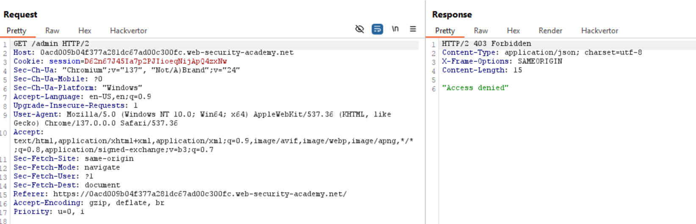
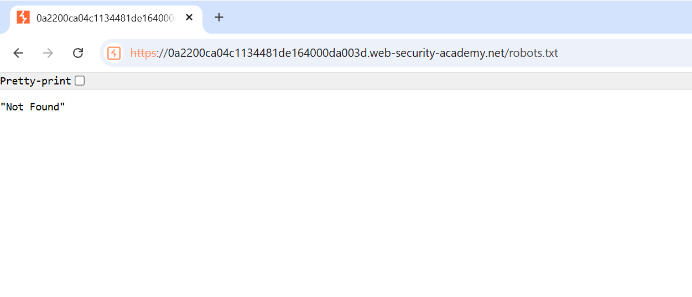
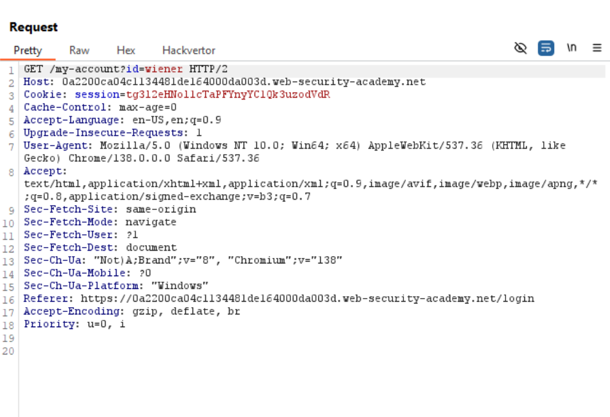

# Kiến thức cần biết

## What is Access Control?

- Access Control phụ thuộc vào Authentication và Session Management:

    - **Authentication**: xác nhận rằng đúng là user đó.

    - **Session Management**: Xác định HTTP request tiếp theo đang được thực hiện bởi 1 người.

    - **Access Control**: Xác định liệu user có thể trình diễn hành động mà họ muốn làm không.

1. Vertical Access Control – Kiểm soát truy cập dọc     
    • ✅ Tên gọi đầy đủ: Vertical Privilege Access Control (Kiểm soát quyền truy cập theo chiều dọc)     
    • ✅ Đặc điểm: Kiểm soát quyền truy cập giữa các cấp độ người dùng khác nhau (ví dụ: user thường vs admin).      
    • ✅ Ví dụ: Một người dùng bình thường không được phép truy cập trang quản trị /admin.      
    • ✅ Khai thác thường thấy: Người dùng thường truy cập trái phép vào chức năng quản trị bằng cách đoán URL, ví dụ /admin/deleteUser.      
=> Đây là lỗi vertical privilege escalation nếu không kiểm soát đúng.     

2. Horizontal Access Control – Kiểm soát truy cập ngang      
    • ✅ Tên gọi đầy đủ: Horizontal Privilege Access Control (Kiểm soát quyền truy cập theo chiều ngang)       
    • ✅ Đặc điểm: Người dùng có cùng cấp quyền chỉ nên truy cập dữ liệu của chính họ, không được truy cập dữ liệu của người dùng khác.       
    • ✅ Ví dụ: User A có quyền truy cập ```/profile?id=1```, nhưng không được phép truy cập ```/profile?id=2```.      
    • ✅ Khai thác thường thấy: Kẻ tấn công thay đổi ID trong URL để xem hoặc thao tác dữ liệu của người khác.       
=> Đây là lỗi horizontal privilege escalation.        


3. Context-Dependent Access Control – Kiểm soát truy cập phụ thuộc ngữ cảnh      
    • ✅ Tên gọi phổ biến: Contextual Access Control hoặc Context-Aware Access Control      
    • ✅ Đặc điểm: Quyền truy cập phụ thuộc vào ngữ cảnh sử dụng, như:      
        ○ Vị trí địa lý (IP)     
        ○ Thời gian (chỉ trong giờ hành chính)      
        ○ Thiết bị (truy cập từ thiết bị đáng tin cậy)     
        ○ Tình trạng tài khoản (đang bị khóa?)      
    • ✅ Ví dụ: Người dùng chỉ có thể rút tiền từ tài khoản nếu đang đăng nhập từ trong nước và đúng múi giờ.      


### Các thuật ngữ:      

- ```IDOR``` vulnerability: Insecure Direct Object Reference

    - IDOR xuất hiện khi 1 nguồn tài nguyên nhạy cảm đặt trong 1 static files trên server-side filesystem


- ```GUIDs```: Globally unique identifiers 


## Lưu ý:

- Broken access control từ sự khác biệt về ```URL-matching```.

- Website có rất nhiều cách để hạn chế họ match path của request vào từ 1 endpoint 

- Ví dụ: Họ **không nhất quán** việc phân biệt chữ hoa thường nên request ```/ADMIN/DELETEUSER``` sẽ được map tới ```/admin/deleteuser```.

  - Trong Spring framework trước Spring 5.3, có sử dụng ```useSuffixPatternMatch``` option. Nó cho phép 1 file với extension tùy ý mapping tới endpoint giống nó nhưng không có extension.

  - Ở các systems khác, có thẻ bắt gặp sự khác biệt trong ```/admin/deleteuser``` và ```/admin/deleteuser/``` được đối xử như 2 endpoint riêng biệt.


# LAB Access Control Vulnerabilites:

## Lab: Unprotected admin functionality

**END goal** Solve the lab by deleting the user carlos.

- Truy cập vào ```/robots.txt``` để xác định xem liệu server có được cấu hình disallow vào đường dẫn nào không.

- Thấy có path tới administrator-panel

==>Vào là ok


## Lab: Unprotected admin functionality with unpredictable URL

**END goal** Truy cập vào admin panel và xóa tài khoản của carlos đi

- Truy cập vào lab và ấn vào My-account, vào burp xem gói tin trả về từ đó:


==>Ở code js này đã có nghĩa nếu user là admin thì sẽ tự gán tới link ```/admin-zusget``` 

==>Ta sẽ truy cập vào theo link đó để vào admin-panel.

==>Solved


## Lab: User role controlled by request parameter

**END goal** Vào admin panel và xóa user carlos

- Bước 1: Thử vào các file như robots.txt:


- -Bước 2: Vào my-account, xem xem có code js nào cấu hình mở đến đường link lạ không ==>Không có nốt

- Bước 3: Đăng nhập vào bằng tài khoản mà lab đã nói. ```wiener:peter```


- Thấy ở cookie có 2 giá trị admin được đặt là false và session, ta suy đoán rằng nếu như thay đổi cho giá trị Admin thành true có thể sẽ đi đến tài khoản administrator.

==>Thử thì thấy có thêm 1 column là admin panel:


## Lab: Lab: User role can be modified in user profile

**END goal** access vào admin panel và dùng nó để xóa tài khoản carlos.

- Vào thử robots.txt:


- Vào My-account đăng nhập tài khoản của wiener.


Xem ở burp ở phần cookie giờ chỉ có 1 giá trị session, không còn giá trị admin để check nữa.

- Vào xem ở interface web:


Ta thử thay đổi email thành wiener@okok-user.net xem thế nào


-Ta thấy gói tin POST ta gửi để change email khi server trả về có 1 giá trị là ```"roleid" : 1``` khá khả nghi, có thể nó là giá trị để định nghĩa admin.
==>Thử thêm vào gói POST của ta 1 giá trị ```roleid : 2```


-Sau khi đã chuyển roleid thành 2 ta vào lại giao diện của web reload lại nó.

==>Thấy có link admin panel

==>Xong lab


## Lab: Lab: URL-based access control can be circumvented

**END goal** access the admin panel and delete the user carlos.

-Khi ta vào lab, thử ấn vào admin panel thì được trả về 403 Forbidden:



-Đầu tiên ta sẽ nói đến khái niệm ```non-stadard header``` : **X-Original-URL**: là 1 header tùy chỉnh được reverse proxy hoặc WAF thêm vào để lưu giữ đường dẫn gốc ban đầu của request HTTP mà client gửi tới, trước khi bị rewrite bởi proxy/nginx/ISAPI Rewrite/IIS,v.v

-VÍ dụ:

```bash
GET /user/profile HTTP/1.1
Host: victim.com
X-Original-URL: /admin
```

+Server sẽ nhận GET ```/user/profile```, nhưng nếu backend tin tưởng và sử dụng giá trị trong ```X-Original-UR```L ==>Nó sẽ xử lý như thể request là ```/admin``` . Tức là sẽ ưu tiên ```X-Original-URL``` trước.


- Complete Guide.

- Đầu tiên thử truy cập vào ```robots.txt```.


==>Không truy cập được.

- Tiếp theo vào thử mục My-Account:


Thấy cũng k có gì để khai thác cả.

- Quay lại home thử vào Admin-panel:


==>Không vào được.

-Từ những dấu hiệu này ta có thể đoán phản hồi Access denied có thể được đưa ra từ hệ thống front-end

- Thử header ```X-Original-URL``` xem có được phép hoạt động không:


==>Hoạt động.

-Ta thử với tiêu đề:


==>Vào lại trang web chính:


- Delete thử ```carlos``` thì bị ```Access denied```

- Ta cần thêm header 1 lần nữa với ```X-Original-URL```:


-Chú ý vì ```X-Original-URL``` khi đưa đến reverse proxy hoặc middleware chỉ có thể xử lý phần **path** chứ không xử lý phần **parameter** nên phần parameter sẽ thêm vào ở GET.

-Vì ```X-Original-URL``` chỉ thay thế phần path chứ không thay thế query string.

-Ví dụ payload sai:


==>Server đã chỉ nhận được /admin/delete nhưng thiếu mất parameter username để delete 1 user nào đó.


## Lab: Lab: Method-based access control can be circumvented

**END goal** log in sử dụng tài khoản administrator:admin xem chức năng của quyền admin sau đó đăng nhập lại vào user wiener:peter rồi exploit các lỗ hổi để nâng quyền lên thành administrator.

- Ở bước đầu send to repeater chức năng upgrade user trong tài khoản admin

- Sau đó khi vào wiener thì copy cái ```section cookie``` của nó rồi paste lại vào cái repeater lúc nãy rồi chuột phải thay đổi request của nó từ POST thành GET là ok.


- Log in administrator:admin and upgrade user:


- Log in user: wiener:peter:


- Get the wiener's session and post it into repeater of administrator:


## Lab: User ID controlled by request parameter

**END goal** obtain the API key for the user carlos and submit it as the solution

- Login vào wiener và thử thay đổi parameter từ ```?id=wiener``` thành ```?id=carlod```


==>Solved.


## Lab: User ID controlled by request parameter, with unpredictable user IDs

**END goal** tìm được GUID của carlos và lấy nó đăng nhập vào như carlos rồi lấy API key submit nó.

- Bước 1: log in wiener:peter

- Bước 2: Vào burp xem trạng thái đăng nhập có gì:


-Giờ id đã không còn là các giá trị có thể dễ dàng đoán được nữa mà thay vào đó là 1 giá trị GUID k thể đoán được.

==>Tìm cách khác.

-Thử vào home bấm vào 1 blog nào đó.


==>Ta thử bấm vào 1 blog của wiener và nhận thấy web đã vô tình để lộ Id của tác giả 

==>Vào tìm blog được đăng bởi carlos là solve.


==>Lấy GUID này cho vào id của wiener lấy API key

==>Solve


## Lab: User ID controlled by request parameter with data leakage in redirect

**END goals**: Lấy được API key của user carlos và submit nó.

- Khi log in vào tài khoản wiener:peter


Ta thấy id đã k được server mã hóa ==>Có thể đoán được.

-Giờ thử đổi id thành carlos xem.


-Khi ta đổi như vậy, trang web đã redirect ta về home do giờ đây ứng dụng đã không cho phép truy cập trái phép tài nguyên của user khác bằng cách redirect về login page, tuy nhiên phần response vẫn trả về API cho mình


==>Xong.


## Lab: User ID controlled by request parameter with password disclosure

**END goal** lấy được password của administratorsau đó dùng nó xóa user carlos (vertical privilege escalation)

- Thử vào robots.txt:




- Quay lại home đăng nhập vào wiener:peter



-Khi xem ở burp thấy id là 1 dạng chuỗi đoán được 

==>Thử đổi thành administrator.


==>Lấy được password của administrator

==>Đăng nhập vào administrator.


## Lab: Insecure direct object references (IDOR)

**END goal** Tìm password của carlos và log in

- Vào phần live chat:


- Ấn thử vào view transcipt thì nó trả về 1 file 2.txt chứa nội dung đoạn chat


==>Suy đoán website đã lưu đoạn chat transcipt chứa trong nguồn tài nguyên lưu ở ```static file``` trên ```server-side filesystem```.

==>Vào burp, thử đổi tên file thành 1.txt:


==>Tìm thấy password


## Lab: Multi-step process with no access control on one step

**END goal** exploit lỗ hổng để nâng đặc quyền của tài khoản wiener lên admin

- Step1: Log in vào administrator -> Admin panel -> Nâng quyền của carlos lên -> Yes

- Step2: Vào burp xem:


-Giờ ta vào tài khoản ```wiener:peter``` lấy session ở cookies của nó copy lại rồi vào lại repeater của admin kia đổi session thành của wiener và username=wiener 

==>Solve lab


## Lab: Referer-based access control

**END goal** Đăng nhập vào wiener:peter và tự mình promote lên thành administrator.

- Step1: Đăng nhập vào administrator -> admin panel -> promote carlos -> Burp history:


==>Thấy cũng khá giống lab trước đó

==>Thử log in vào wiener để lấy session r vào lại repeater:


- Giống hệt lab trước :)))