# Kiến thức cần biết:

## Files for web crawlers

Many website provide files at ```/robots.txt``` or ```/sitemap.xml```

## HTTP Method TRACE:    

- ```TRACE``` là 1 HTTP method dùng để echo lại chính request mà server nhận được. Nếu không bị vô hiệu hóa, nó có thể tiết lộ các header nội bộ mà server hoặc proxy tự chèn vào.

- TRACE có thể bỏ qua bước check quyền truy cập người dùng mà chỉ echo lại toàn bộ request bạn gửi vào (bao gồm header), giống như gương phản chiếu
- Tức là nếu server/proxy/nginx/load balancer tự thêm header nội bộ (các header không thể thấy trong Burp) cũng có thể lộ ra nếu dùng ```TRACE```


# Lab Information Disclosure:

## Lab: Information disclosure in error messages

**END goals**: find out the version of framework in this website.

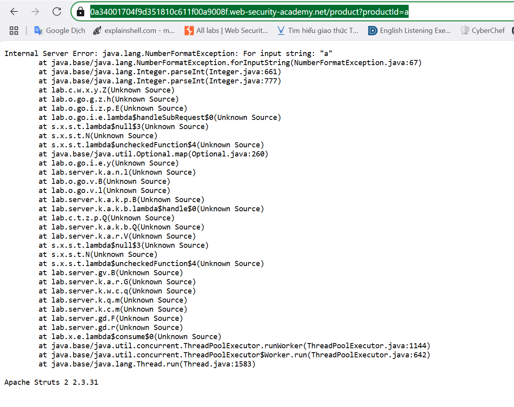

- Change parameter ```productId``` from interger number to a string or other, error message appear include internal information

## Lab: Information disclosure on debug page

**END goals**: find out SECRET_KEY environment variable.

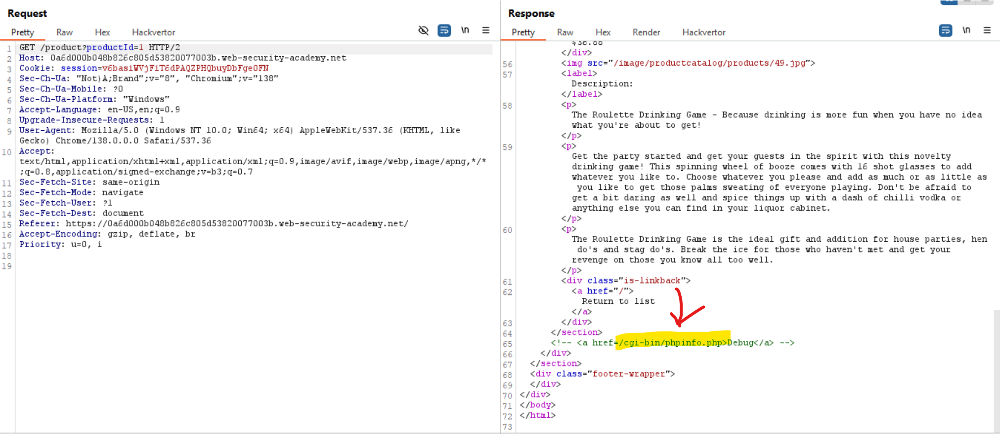

==>Look at this comment, we try redirect to ```/cgi-bin/phpinfo.php``` and see:

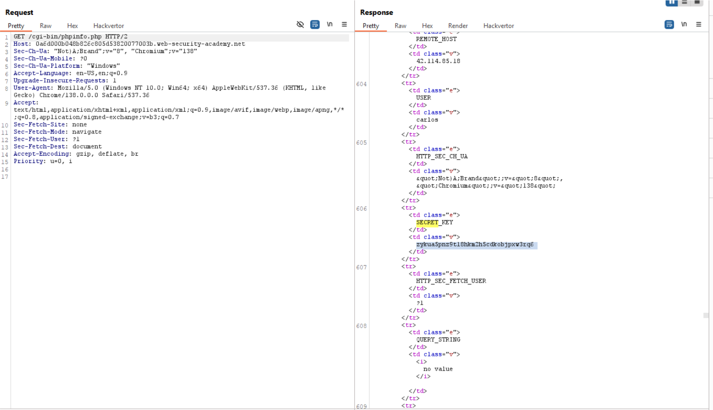


## Lab: Source code disclosure via backup files

**END goals**: find out the database password, which is hard-coded in the leaked source code.

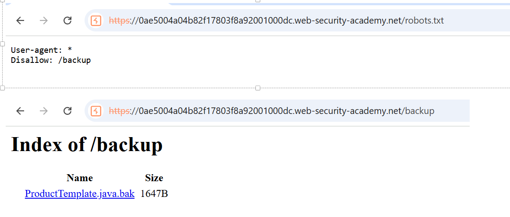


## Lab: Authentication bypass via information disclosure

**END goals**:
  - Lấy tên custom HTTP header mà front-end sử dụng để xác thực quyền truy cập admin
  - Giả mạo header đó để truy cập admin, xóa user carlos

-Thử gửi request ```GET /admin```:

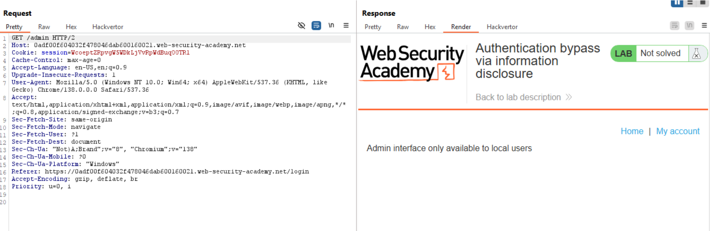

Thấy 1 message chỉ có local user mới được truy cập admin

==> Vậy thử dùng non-standard header ```X-Original-URL: admin```

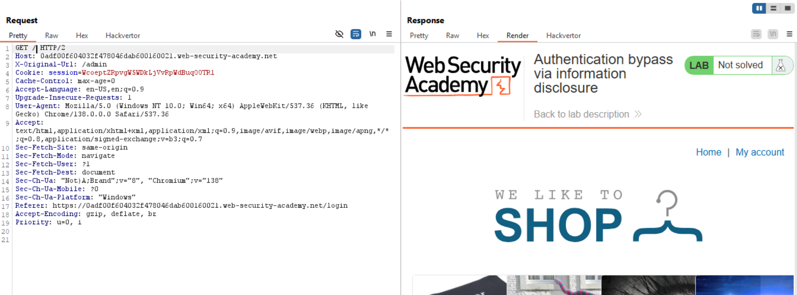

==> Thành công nhưng khi chuyển về giao diện home thì không hoạt động

-Thử thay heade thành ```TRACE``` để đọc các request mà phía client (mình) gửi đi:

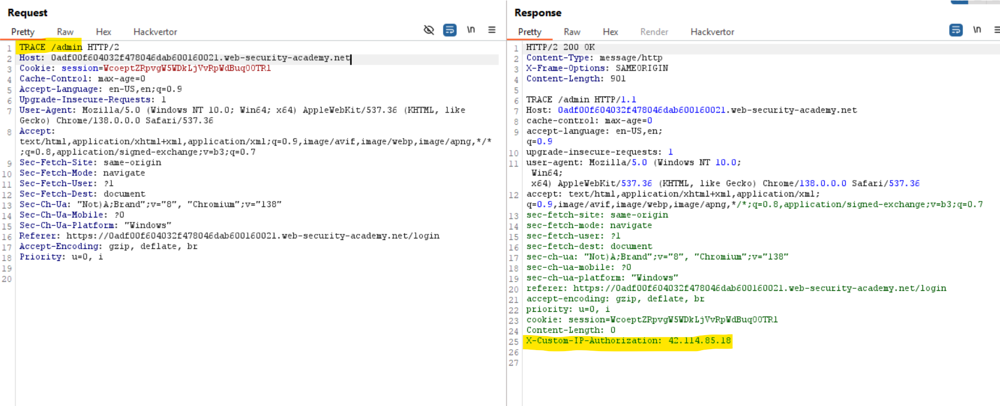

==>Thấy ở phần server nhận được có header lạ: ```X-Custom-IP-Authorization: 42.114.85.18```

==>Gửi gói tin: 

```bash
GET /admin HTTP/2
Host: 0adf00f604032f478046dab600160021.web-security-academy.net
X-Custom-Ip-Authorization: 127.0.0.1
```

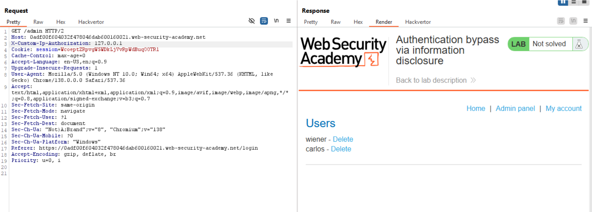


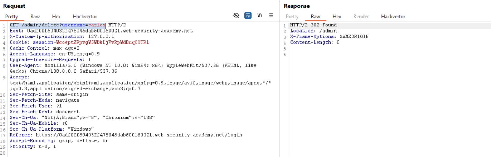


## Lab: Information disclosure in version control history

**END goals** 
  - Lộ dữ liệu qua version control history.
  - Lấy được password của administrator user sau đó login vào và xóa carlos user.

- Thử truy cập endpoint ```.git``` của website:

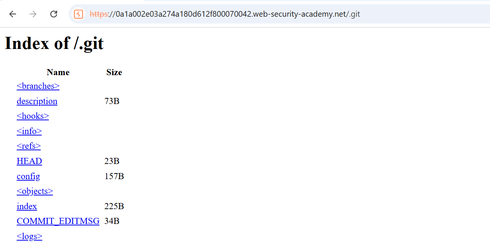

- Tải ```.git``` về máy:

```wget -r https://0a1a002e03a274a180d612f800070042.web-security-academy.net/.git```

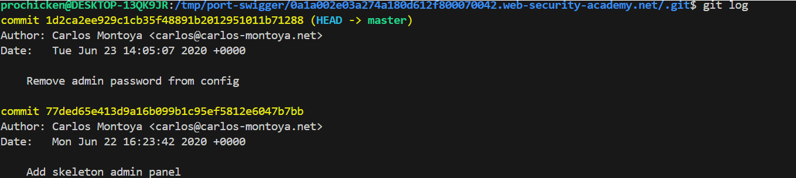

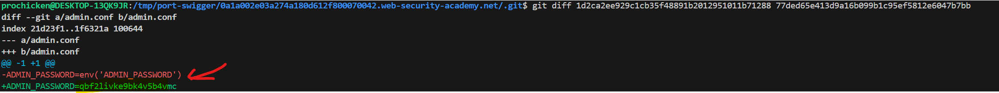