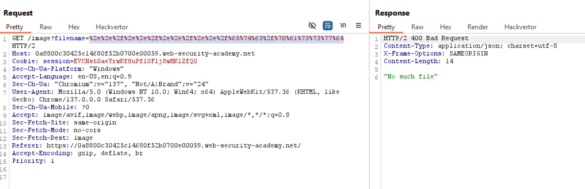

# Kiến thức cần biết:

## Path Traversal là gì:

- Path Traversal cho phép 1 attacker có thể đọc file tùy ý đang chạy 1 ứng dụng trên server.

- Bao gồm:

    - Code và data application

    - Thông tin xác thực(Credentials) cho backend systems.

    - Sensitive operating system files

- Trong nhiều trường hợp, 1 attacker còn có thể viết 1 file tùy ý lên server, cho phép chỉnh sửa dữ liệu hoặc hành vi và có thể "Full Control"server đó.

# Lab Path traversal

## Lab: File path traversal, simple case

**END goals**: retrieve data in path /etc/passwd.

-Khi truy cập vào lab, ta thấy server đang truy cập tới các đường dẫn ```/image/filename = ...``` Để tải các ảnh lên.


==>Nhanh chóng send to repeater rồi thay đổi đường dẫn của file là lụm.


## Lab: File path traversal, traversal sequences blocked with absolute path bypass

**END goals**: lấy data từ path /etc/passwd

-Thử làm như lab trước đó thì được trả về là:


==>Thử viết absolute path vì có thể developer đã filter các chuỗi duyệt thư mục như ```../../...```


## Lab: File path traversal, traversal sequences stripped non-recursively

**END goal**: Lấy data từ path: /etc/passwd

-Đầu tiên thử với việc ```../../../../etc/passwd```:


- Khi không được, ta thử với absolute path:


Cũng không được :))

==>Ta sẽ nghĩ đến trường hợp deveploper đã lọc đệ quy ở mỗi redirect như việc nếu gặp dấu slash '/' sẽ xóa chuỗi ../

==>Ta sẽ dùng gấp đôi cái kí tự đó là được:


## Lab: File path traversal, traversal sequences stripped with superfluous URL-decode

**END goals**: Lấy data từ path /etc/passwd nhưng ở lab này, ứng dụng đã chặn các input chứa path traversal tức là ../../... Sau đó nó decode URL của input trc khi sử dụng.

- Thử với path traversal cơ bản:


- Thử với absolute path:


- Thử với strip recursive path traversal:


- Ta suy đoán ứng dụng đã chặn các input có path traversal rồi mới  đưa vào sử dụng ==>Thử encode 1 lần:



==>Vẫn k được

==>Suy đoán nó đã encode rồi mới check rồi mới đưa vào sd

==>Encode lần nữa:


## Lab: File path traversal, validation of start of path

**END goals**: Lấy data từ /etc/passwd.


==>Ở bài này cho ta biết, 1 số ứng dụng có thể yêu cầu user cung cấp 1 đường dẫn cố định để bắt đầu truy cập thư mục.

- Ví dụ như lab này yêu cầu truy cập vào bằng path cố định là:

```/var/www/images/....```


## Lab: File path traversal, validation of file extension with null byte bypass

**END goal** retrieve the contents of the /etc/passwd file.

- File images ban đầu:


- Ta thấy ở file này có extension sau là .jpg

==>Suy đoán application đã yêu cầu extension để kết thúc path phải là ```.jpg```

==>Có thể dùng kí tự NULL để kết thúc trước khi application check tới extension 

  - NULL được encode là ```%00```


