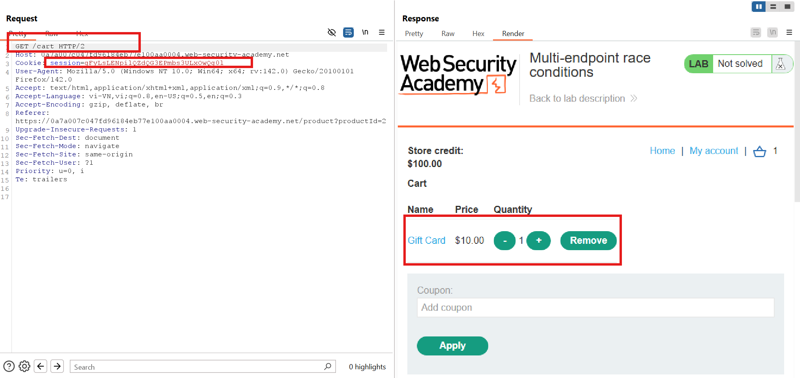

# Kiến thức cần biết

## Turbo Intruder

- Là 1 plugin cho Burp Suite cho phép:      
    • Gửi hàng trăm, hàng nghìn request cực nhanh     
    • Gửi song song, tuần tự, hoặc cùng lúc (zero jitter)     
    • Tùy biến payload và logic gửi requets bằng ```Python3```      
    • Hoạt động cực hiệu quả khi cần tạo ```race condition```, ```bypass rate-limit```, ```JWT brute-force```, v.v       
- Cách hoạt động: Turbo Intruder sử dụng engine ```non-blocking```, ```asynchronous client```, kết hợp với:        
    • Threading tối ưu.     
    • HTTP pipelining (gửi nhiều request trên 1 kết nối TCP)     
    • Batch sending (gửi gộp hàng chục request trong 1 packet nếu có thể)     


## Các attack models thường gặp

1. Parralel attack (**song song/ đồng thời**):       
    - Ý tưởng: Nhiều request/gói tin được gửi cùng lúc (song song, đa luồng).      
    - Mục tiêu: tận dụng "race conditon" hoặc làm nghẽn server.      
    - Ví dụ:       
        - Brute-force song song: gửi 100 password cùng lúc để bypass rate limit      
        - Race condition: 2 request cùng chỉnh số dư tài khoản trong banking app --> Hệ thống xử lý **"cùng lúc"**      
        -->Rút tiền x2     
        - DoS SYN flood: spam TCP SYN đồng thời để exhaust socket queue.      
==>Đây chính là loại dùng khi làm các bài "**rate-limit**" with Turbo Intruder      

2. Sequence attack (tuần tự / theo chuỗi):      
    - Ý tưởng: tấn công được thực hiện theo thứ tự cụ thể, mỗi bước phụ thuộc vào kết quả bước trước.      
    - Thường gặp khi logic application đòi hỏi 1 workflow nhất định.      
    - Ví dụ:      
        - Đăng nhập --> Nhận token --> Dùng token đó để gọi API. Nếu attacker lách qua "step check" thì sequence có thể bị phá.      
        - CSRF token genaration --> attacker đoán token step-by-step     
        - Replay tấn công: Gửi request A (Lấy mã OTP), rồi sau đó request B dùng OTP đó -->Theo đúng "sequence"     
==>Loại  này không nhanh như parallel, mà "mò mẫm" step-by-step theo flow chuẩn của app.       

3. Single-packet attack:      
    - Ý tưởng: Thay vì spam nhiều request, attacker chỉ cần 1 packet duy nhất để trigger bug --> impact lớn.      
    - Thường liên quan đến memory corruption, protocol bug, hay logic flaw.      
    - Ví dụ:      
        - Ping of Death: Chỉ 1 ICMP packet oversized --> crash máy      
        - Teardrop attack: 1 packet fragmented sai --> kernel panic      
        - Một request duy nhất với payload crafted --> SQL injection UNION --> dump data ngay.       
        - Với web app: "single HTTP request" có thể bypass auth nếu param được cấu hình sai (admin=true).      
==>Đây là dạng chí mạng, chỉ 1 shot -->Game over, không cần brute-force.       


## Warming Connection
- Thay vì bắn luôn các request quan trọng khi conenction còn **"lạnh"**, ta gửi trước 1 request nhỏ (như GET /) để:
    - Đảm bảo server đã tạo connection, bắt đầu bắt tay (handshake)
    - Tránh các delay ban đầu (connection init delay, DNS lookup, TLS handshake)
    - Tăng khả năng 2 request sau xảy ra gần như cùng lúc -->Dễ trúng race condition hơn.

==>Mục đích chính: Làm cho 2 request (add + checkout) xảy ra trong khoảng thời gian ngắn hơn -->Tăng tỉ lệ race thành công.


# Lab Race Conditions

## Lab: Limit overrun race conditions

**END goals** Purchase a Lightweight L33t Leather Jacket with only 50$

- Use all of the application's available functionality, including using the PROMO code when purchasing an item.

- Send the following request to Burp Repeater (ensure to have added the expensive Jacket into your cart):


- Send 20 same requests to Burp Repeater then **"Add to tab group"** 

-->Click **"Send group in parralel (Single packet attack)"**


--> The coupon is only supposed to be used once per order, but exploiting a race condition vulnerability allows for a bypass.


## Lab: Bypassing rate limits via race conditions

**END goals**: delete the user "carlos"

- Khi ta ```"POST /login"```, ta send cookie session, csrf token, username, password như gói tin:

```bash
POST /login HTTP/2
Cookie: session=NqzuYk8x8WOtZDoRCsWadDfpk6jPdzW6
csrf=Tci7qNWTsceVLqKNBFCzebSji8PpXJtb&username=hello&password=hehe
```

- Và thấy lab này có cơ chế đăng nhập sai 3 lần là bị lock lại 1 phút.

- Đây là flow mình đoán trong server:


- Lab này, ta cũng sẽ thử tạo 1 group gồm 20 gói tin ```POST /login``` với credential sai và send với parallel, xem kết quả thì ta thấy các gói tin có thể bị dính rate limit vì có nhiều hơn 3 gói tin liên tiếp không bị lock:


- Nhưng ta cần phân biệt rằng:

    - **Repeater**: Giống như việc bấm F5 cực nhanh 50 lần. Thực ra server vẫn thấy là ```request 1, rồi request 2, rồi request 3,...``` " chênh nhau vài ms --> rate-limit có thể kịp cộng

    - **Turbo Intruder**: Giống 50 người cùng lúc bấm F5 trong cùng 1 thời điểm -->Server chưa kịp tăng counter -->Cả 50 req lọt.


- Chiến thuật giải bài:

    - Hệ thống đếm số lần login không kịp nếu nhiều req được gửi đồng thời

    - Sử dụng Turbo Intruder


- Ý tưởng:

    1. Hiểu hạn chế: login "carlos" bị rate-limit (3 lần)       
    2. Ý tưởng bypass: gửi nhiều request song song để bypass counter       
    3. Thực thi: Dùng Turbo Intruder -->Mở gate --> Bắn 1 đống request với wordlist password được cung cấp.       
    4. Kết quả: 1 trong số các request sẽ match password đúng (server trả về 302)      
    5. Login: dùng pass tìm được để vào carlos, vào /admin, xóa user -->Solved.        


- Script turbo intruder:

```python
def queueRequests(target, wordlists):

    # as the target supports HTTP/2, use engine=Engine.BURP2 and concurrentConnections=1 for a single-packet attack
    engine = RequestEngine(endpoint=target.endpoint,
                           concurrentConnections=1,
                           engine=Engine.BURP2
                           )
    
    # assign the list of candidate passwords from your clipboard
    passwords = wordlists.clipboard
    
    # queue a login request using each password from the wordlist
    # the 'gate' argument withholds the final part of each request until engine.openGate() is invoked
    for password in passwords:
        engine.queue(target.req, password, gate='1')
    
    # once every request has been queued
    # invoke engine.openGate() to send all requests in the given gate simultaneously
    engine.openGate('1')


def handleResponse(req, interesting):
    table.add(req)
```


## Lab: Multi-endpoint race conditions

- **END goals**: purchase a Lightweight L33t Leather Jacket.

-Ý tưởng:

    • Cart được lưu trên server-side dựa trên session.

    • Khi checkout, server:

        1- Xác thực giỏ hàng và số tiền        
        2- Nếu đủ tiền --> Thanh toán --> Trừ tiền và gửi order     
-->Nếu có thể thêm món hàng ngay sau bước xác thực nhưng trước khi bước thanh toán (checkout) hoàn tất thì:

Server sẽ nghĩ cậu chỉ thanh toán đơn hàng(rẻ), nhưng lại xử lý luôn cả cái áo xịn (quá giá) trong cùng order.

==>Đây là classic multi-endpoint race condition.


- Bước 1: Đăng nhập, mua 1 item

- Bước 2: Phân tích cơ chế giỏ hàng:

1. Kiểm tra ```GET /cart``` để xem cart state



2. Thử truy cập ```GET /cart``` mà không gửi session cookie:

Thấy cart rỗng --> Biết rằng cart được gắn với session, không client side --> Có thể gây **race condition** theo session:


3. Benchmark thời gian:       
    1. Gửi 2 request vào Repeater:       
        ○ ```POST /cart``` (đã thêm item)       
        ○ ```POST /cart/checkout``` (thanh toán)         
    2. Gộp cả 2 vào 1 tab group -->Gửi theo thứ tự (sequence) -->Xem thời gian phản hồi         
        ○ Nếu request thứ 2 (checkout) phản hồi rất nhanh, chứng tỏ server có thể đang xử lý không đồng bộ, tức là có thể tấn công race         
        ® Lưu ý: Có thể thêm 1 request GET / (homepage) để "***warming connection***", giúp thu hẹp race window hơn.         

4. Thử với jacket:        
    • Đảm bảo chỉ còn 1 item trong cart        
    • Thay ProductId thành 1 (id của jacket)       
    • Gửi chuỗi 2 req theo sequence:      
        - ```POST /cart``` (thêm áo)         
        - ```POST /cart/checkout```         


Thử hơi nhiều lần T_T


## Lab: Single-endpoint race conditions

- **END goals**:         
    1. Identify a race condition that lets you claim an arbitrary email address.         
    2. Change your email address to carlos@ginandjuice.shop.         
    3. Access the admin panel.          
Delete the user carlos          

- Attack idea: Luồng logic bình thường:         
    1. User muốn đổi emai --> Gửi POST /my-account/change-email với địa chỉ mới           
    2. Server:             
    • Ghi "pending email" vào DB (chờ confirm)          
    • Gửi email có link xác nhận tới địa chỉ đó          
User click link --> Xác nhận --> email chính thức được đổi.               

==>Where is vulnerable?           
    • App chỉ lưu 1 email chờ xác nhận (pending) tại 1 thời điểm.       
    • Nếu gửi nhiều request đồng thời, mỗi cái đổi 1 email khác nhau (1 cái gửi exploit@... , 1 cái gửi carlos@...)          
    ==>Sẽ có "race window": Trong lúc server gửi email xác nhận, nó đọc địa chỉ từ DB, nhưng đã bị ghi đè bởi request khác          
    • Kết quả:           
        ○ Server gửi mail đến exploit@..., nhưng trong nội dung mail lại ghi "click to confirm email: carlos@..."           
Nếu click vào link đó -->Server xác nhận email thành công cho carlos.              

==>Xảy ra "race condition" trong logic: gửi mail chậm hơn việc ghi đè DB --> mismatch giữa to: và nội dung mail.

- Bước 1: Đăng nhập wiener:peter

- Bước 2: Thử đổi email bình thường:


  - Đổi thành email gì nó sẽ hiện thông báo lên web như này với gói tin:


- Bước 3: Thử gửi 2 request POST với 2 email khác nhau (Benchmark behavior) với parallel:


Và nhìn lại trên website:


==> Phát hiện ra "race condition logic"

-Bước 4: Real attack:

    • Tạo 2 request:

        ○ POST /my-account/change-email --> email là test@exploit....

        ○ POST /my-accout/change-email -->email là carlos@ginandjuice.shop

    • Gửi cả 2 với parralel

    • Vào inbox để confirm --> Quay lại home-page --> xóa carlos user.


## Lab: Exploiting time-sensitive vulnerabilities

- **END goals**: 

    1. Identify the vulnerability in the way the website generates password reset tokens.              
    2. Obtain a valid password reset token for the user carlos.           
    3. Log in as carlos.             
    4. Access the admin panel and delete the user carlos.            

-Ý tưởng chính: Hệ thống sinh token reset mật khẩu dựa trên timestamp (giây hiện tại), và KHÔNG phân biệt user.

    • Nếu 2 người gửi request reset password tại đúng thời điểm, token sẽ trùng nhau --> 2 user được cấp cùng 1 token

-Cách exploit lỗi: Ép server cấp token của carlos = token của mình --> Nhận được token đó qua email --> Dùng link đó đổi password của carlos luôn :))

- Bước 1: Reset password cho wiener:

    • Mở ```POST /forgot-password``` --> Gửi yêu cầu reset

    • Mở inbox ở ```exploit-server``` --> Xem token trong link:

    

    • Gửi vài lần, quan sát thấy token khác nhau mỗi lần gửi --> Suy đoán token này không random mà dùng theo timestamp hoặc counter

- Bước 2: Kiểm tra xem có bị "***khóa theo session***" không:

    • Gửi 2 ```POST /forgot-password``` cùng lúc (parralel) --> token vẫn khác nhau

    • Suy luận: server xử lý từng session một (PHP behavior) --> 2 request dùng cùng session vẫn chạy nối tiếp --> không ăn


- Bước 3: Bypass bằng cách dùng 2 session khác nhau:

  - Mở ```GET /forgot-password``` --> gửi không có cookie --> Nhận response kèm:

        ○ CSRF token mới

        ○ Set-cookie: ```phpsessionid=...```

  - Dùng cookie & CSRF đó để làm POST /forgot-password mới --> Tạo 2 request:

    |Request 1 (original session)    |	Request 2 (new session)|
    |username: wiener    |	username: wiener|
    |cookie: phpsessionid=abc    |	cookie: phpsessionid=xyz|
    |csrf: ...   |	csrf: mới|

  - Gửi 2 req này song song (parralel):

==>Lúc này vì là 2 session riêng biệt, server sẽ xử lý cùng lúc --> Khả năng token sẽ giống nhau nếu thời gian trùng khít. Kiểm chứng:


==> Thay username = carlos ở 1 trong 2 req, lấy token đó đổi password cho carlos rồi xóa user carlos đi là ok

