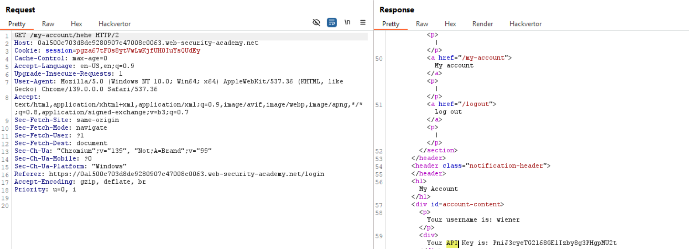

# Kiến thức cần biết

## Web cache

- Web cache là lớp trung gian (CDN, reverse proxy) giữa client và server.

- Cache sẽ lưu trữ các response tĩnh (CSS, JS, hình ảnh-png,...) để giảm tải cho server gốc

- Web Cacache Deception (WCD):

    • Ý tưởng: ép cache lưu trữ sesitive content (private) như "/my-account", bằng cách lợi dụng sự khác biệt trong cách phân tích URL giữa cache và origin server

    • Ví dụ:

        ○ Origin server thấy "my-account/abc.js" vẫn map về "my-account" --> Trả về sesitive data

        ○ Cache thấy có ".js" --> Tưởng là static file --> Cho cache copy


- Path mapping discrepancy: là sự khác biệt khi xử lý URL:

    • Cache sử dụng regex rule --> coi "/abc.js" là file tĩnh --> cache

    • Server map "my-account/anything" về "my-account" --> Vẫn trả dữ liệu private 

## Path delimiters charector

- Là các kí tự đặc biệt trong URL, được origin server coi như dấu phân cách trong path.

- Ví dụ: /my-account;hehe hay /my-account?hehe   --> Có thể vẫn map về "/my-account"

- Discrepancy ở đây: 

    • Với origin server: Có thể bỏ qua phần sau ";" hoặc "?" --> Vẫn trả về data private

    • Cache: Lại coi toàn bộ "/my-account;hehe.js" là 1 file tĩnh (file .js)   --> Cache lại

==>Đây chính là vấn đề

- Lấy list các charector delimiter ở đây: [here](https://portswigger.net/web-security/web-cache-deception/wcd-lab-delimiter-list)

## Normalization Descrepancy

- Nomalization: 

    • Origin server có thể giải mã (%2f -> /) và xử lý các đoạn dot-segment (.. --> path traversal)

    • Ví dụ: /aaa/..%2fmy-account   --> Sau khi normalize sẽ thành /my-account

- Sự khác biệt giữa cache và origin server trong normalization:

    • Origin server: normalize path trước khi xử lý.

    • Cache: thường chỉ nhìn path raw (chưa normalize)

    • Điều này dẫn đến discrepancy:

        ○ Server coi /resource/..%2fmy-account  <==> /my-account  --> Trả về API key
        
        ○ Cache coi /resource/.. Là 1 static directory /resource ==> Lưu cache lại

- Static directory cache rule:

  - Một số cache có rule: Mọi path bắt đầu bằng /resource/ sẽ bị cache (vì được cho là static file)

  - Đây là điểm yếu mà ta có thể khai thác


## Static Cache Rule

-Ngoài Cache Rule thông thường (Cho phép cache các file dạng static dựa vào extension .css, .js, .png,...)

-Thì còn 1 số reverse proxy/CDN (ví dụ: Akamai, Varnish, CloudFront) hay cấu hình dựa trên đường dẫn (path prefix)

-Nghĩa là:

    • Tất cả file nằm trong "/resources/" --> Coi là "static assets" (JS, CSS, hình ảnh)

    • Những Path này thường ít thay đổi, không nhạy cảm --> có thể cache để tăng hiệu năng.

==>Những quy tắc như vậy được gọi là "Static directory cache rule"

Ví dụ:
```bash
Cache rule: /resources/* → cache 30s
Cache rule: /images/* → cache 1h
Cache rule: /api/* → no-store
```


## Bản chất của Web Cache Deception

- Bản chất của WCD chỉ xoay quoanh việc: ai normalize URL trước, cache hay origin server

1. Khi nào là origin server normalization?

    • Ta gửi 1 req dạng "/hehe/..%2fmy-account"

    • Nếu origin xử lý "..%2f" --> Biến thành "/my-account" thì response sẽ là 200 + API key

    • Cache lúc này deck quan tâm, chỉ coi path là "/hehe/...."

==>Origin server đóng vai trò normalize 

==>Sensitive data xuất hiện nhưng cache thì chưa chắc đã cache


***Dấu hiệu nhận biết**

    • Origin trả về nội dung hợp lệ sau khi đi qua đoạn normalize (..%2f)

    • Cache không normalize, vẫn giữ nguyên path

2. Khi nào là Cache normalization?

    • Ta thử payload "/my-account%23%2f..%2fresources".

    • Origin thấy %23 (hoặc %2f) làm delimiter ==> Chỉ xử lý "/my-account" và trả về API key

    • Cache lại "normalize full path" thành "/resources" ==> Áp dụng "Static directory cache rule"

    • Kết quả: Cache lưu response chứa API key, sau đó phục vụ lại cho victim.

***Dấu hiệu nhận biết**

    • Origin không hiểu dot-segment hay ký tự đặc biệt như %23, %2f,... Theo cùng cách với cache.

    • Cache thì normalize khác đi (Ví dụ: Biến path thành /resources)


# Lab Web cache deception

## Lab: Exploiting path mapping for web cache deception

**END goals**: find the API key for the user "carlos".

- Khi đăng nhập với credential cho trước, ta thấy API key cá nhân được hiển thị


- Ta sẽ đi kiểm tra Path Mapping Discrepancy:

  - Gửi request ```GET /my-account``` --> Thấy API key


  - Thử đổi thành ```GET /my-account/hehe``` --> Vẫn thấy API key:



-->Chứng tỏ server map tất cả về "/my-account"

    • Đổi thành "GET /my-account/hehe.js --> Response vẫn có API key nhưng có thêm:

        ○ Cache control: max-age=30

        ○ X-Cache: miss (lúc đầu), sau khi gửi lại --> X-Cache: hit

-->Chứng tỏ cache đang lưu trữ sensitive data


-Nắm được điều này, ta bắt đầu tạo exploit để lừa victim:

    • Target: Ép "carlos" truy cập vào "my-account/prochicken.js"

    • Dùng exploit server, chèn script:

```html 
<script>
  document.location="https://0a1500c703d8de9280907c47008c0063.web-security-academy.net/my-account/prochicken.js"
</script>
```


    • Deliver exploit --> Carlos bị redirect tới "/my-account/prochicken.js"

Khi carlos load --> cache server sẽ lưu API key của carlos.


==>Giờ truy cập trực tiếp vào URL trên, ta nhận được kết quả:


## Lab: Exploiting path delimiters for web cache deception

**END goals**: find the API key for the user "carlos"

- Bước 1: Login với credential cho trước --> Thấy API key hiện ra

- Bước 2: Test parameter delimiter charector:

    • Gửi "/my-account/hehe" --> Not Found

    • Gửi "/my-accounthehe" --> Not Found

    • Gửi "/my-account;hehe" và "/my-account?hehe" --> Hiện API như lúc login

--> Server coi kí tự ";" và "?" là delimiter charector


- Bước 3: Check cách cache xử lý:


  - Với ";" , lần 1 cache miss, lần 2 cache hit ==> Cache không hiểu kí tự ";"  và coi toàn bộ path là static ".js" --> Được cache lại

  - Thử với "?":


==> Không bị cache (Không có các header cache bên response)

-Bước 4: Tạo exploit:

    • Vào exploit-server, cho script này vào để khi carlos vào exploit-server sẽ tự động bị redirect tới /prochicken.js --> Server trả về API key của carlos --> Cache lưu lại:

```html
<script>
document.location="https://0aaa00c8043196018075a805005d00b1.web-security-academy.net/my-account;prochicken.js"
</script>
```


## Lab: Exploiting origin server normalization for web cache deception

**END goals**: find the API key for the user "carlos"

- Bước 1: Test normalization:

    • Gửi req: "```GET /hehe/../my-account HTTP/2```" --> Có API key hiện ra
    
==> Origin server normalize dot-segment

- Bước 2: Tìm static cache rule:

Quan sát thấy các file static như css, js đều nằm dưới ```/resource/```


Test thử: "```/resource/hehe```" :


==>Trả 404 nhưng có cache 

==>/resources/là static directory cache rule.

-Bước 3: Kết hợp cache rule + normalization:

    • Gửi "/resources/../my-account"   --> server normalize về "/my-account" --> Trả API key, cache thì coi đây là "/resource/..."  --> Lưu lại

-Bước 4: Tạo script exploit:

```html
<script>
document.location="https://0ada001c03f9b32180d0d639005e00ff.web-security-academy.net/resources/..%2fmy-account"
</script>
```


- Ở web này ta xác định origin server đóng vai trò normalization!!!


## Lab: Exploiting cache server normalization for web cache deception

**END goals**: find the API key for the user "carlos"

- Giống lab trước nhưng khác ở chỗ:


==>Suy đoán Cache là bên normalize

- Với các bài có Cache là bên normalize, ta cứ encode hết đi cho nó mát vì server sẽ nhận data rồi mới xử lý cái đó nên k lo

- Follow req:


==> SOLVED


